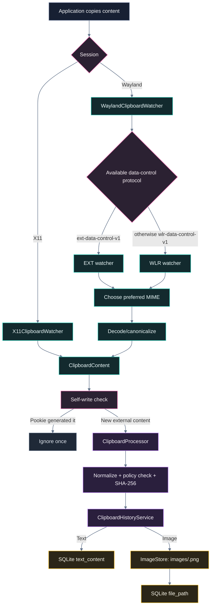
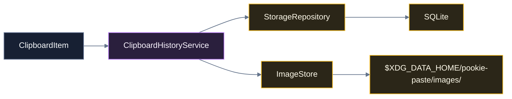
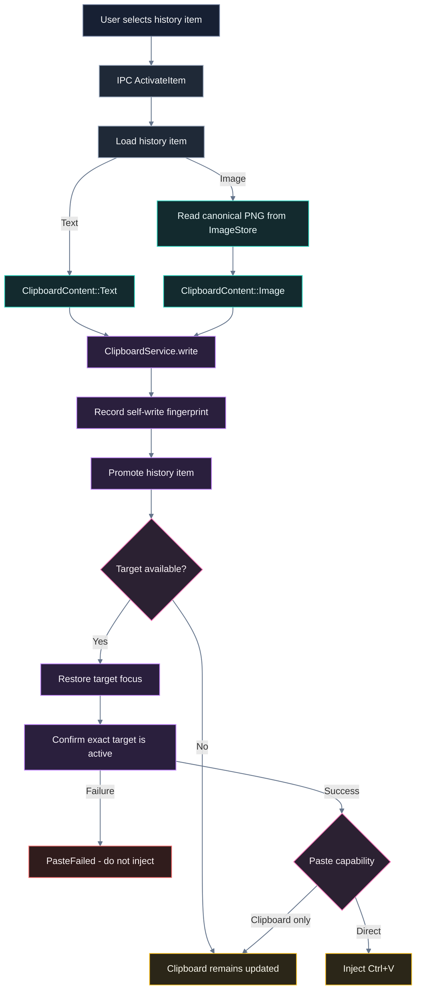

# Pookie Paste Architecture

## Overview

Pookie Paste is a Linux clipboard history manager built around a long-running daemon and a short-lived popup UI.

The current v1 content model supports:

- Text
- Images

The design keeps platform-specific clipboard, focus, and paste behavior behind abstractions so the history, processing, IPC, and UI layers do not need to know whether the current session is X11 or Wayland.

---

## System Architecture

```mermaid
flowchart LR
    %% External desktop entry points
    subgraph Desktop["Linux desktop session"]
        direction TB
        Apps["Applications"]
        Shortcut["Super+V"]
    end

    %% Platform clipboard boundary
    subgraph ClipboardLayer["pookie-clipboard"]
        direction TB
        CB["ClipboardBackend"]
        CW["ClipboardWatcher"]

        subgraph X11["X11"]
            direction TB
            X11Clipboard["X11Clipboard<br/>arboard read/write"]
            X11Watcher["X11ClipboardWatcher<br/>polling watcher"]
        end

        subgraph Wayland["Wayland"]
            direction TB
            WaylandClipboard["WaylandClipboard<br/>wl-clipboard-rs read/write"]
            WaylandWatcher["WaylandClipboardWatcher"]
            EXT["ext-data-control-v1<br/>preferred watcher"]
            WLR["wlr-data-control-v1<br/>fallback watcher"]
        end
    end

    %% Core runtime
    subgraph Daemon["daemon"]
        direction TB
        PlatformClipboard["PlatformClipboard"]
        ClipboardService["ClipboardService"]
        ClipboardState["ClipboardState<br/>self-write suppression"]
        Processor["ClipboardProcessor"]
        History["ClipboardHistoryService"]
        Activation["ClipboardActivationService"]
        Focus["PlatformFocusBackend"]
        Paste["PlatformPasteBackend"]
    end

    %% Data and communication boundaries
    subgraph Storage["Persistence"]
        direction TB
        SQLite["SQLite<br/>history metadata + text"]
        ImageStore["ImageStore<br/>canonical PNG files"]
    end

    subgraph IPC["ipc"]
        direction TB
        Socket["Unix-domain socket"]
        Protocol["Typed request/response protocol"]
    end

    subgraph UI["Popup UI"]
        direction TB
        ThumbnailCache["In-memory thumbnail cache"]
        HistoryUI["Mixed text/image history"]
    end

    Apps --> CB
    Apps --> CW

    PlatformClipboard --> CB
    CB --> X11Clipboard
    CB --> WaylandClipboard

    CW --> X11Watcher
    CW --> WaylandWatcher
    WaylandWatcher --> EXT
    WaylandWatcher --> WLR

    CW --> ClipboardState
    ClipboardState --> Processor
    Processor --> History

    History --> SQLite
    History --> ImageStore

    Shortcut --> UI
    UI --> Socket
    Socket --> Protocol
    Protocol --> Activation
    Protocol --> History

    History --> HistoryUI
    ImageStore --> ThumbnailCache
    ThumbnailCache --> HistoryUI

    Activation --> ClipboardService
    ClipboardService --> PlatformClipboard
    ClipboardService --> ClipboardState
    Activation --> Focus
    Activation --> Paste

    classDef desktop fill:#172033,stroke:#6b7a99,color:#f8fafc,stroke-width:1.4px;
    classDef abstraction fill:#172554,stroke:#60a5fa,color:#eff6ff,stroke-width:1.4px;
    classDef platform fill:#132a2e,stroke:#2dd4bf,color:#ecfeff,stroke-width:1.3px;
    classDef service fill:#2a1f3d,stroke:#c084fc,color:#faf5ff,stroke-width:1.4px;
    classDef storage fill:#2b2618,stroke:#fbbf24,color:#fffbeb,stroke-width:1.3px;
    classDef protocol fill:#1f2937,stroke:#94a3b8,color:#f8fafc,stroke-width:1.3px;
    classDef ui fill:#2b2132,stroke:#f472b6,color:#fdf2f8,stroke-width:1.3px;

    class Apps,Shortcut desktop;
    class CB,CW abstraction;
    class X11Clipboard,X11Watcher,WaylandClipboard,WaylandWatcher,EXT,WLR platform;
    class PlatformClipboard,ClipboardService,ClipboardState,Processor,History,Activation,Focus,Paste service;
    class SQLite,ImageStore storage;
    class Socket,Protocol protocol;
    class ThumbnailCache,HistoryUI ui;

    style Desktop fill:#0b1120,stroke:#334155,stroke-width:1px,color:#cbd5e1;
    style ClipboardLayer fill:#0b1220,stroke:#2563eb,stroke-width:1.2px,color:#bfdbfe;
    style X11 fill:#0d1f24,stroke:#0f766e,stroke-width:1px,color:#99f6e4;
    style Wayland fill:#0d1f24,stroke:#0f766e,stroke-width:1px,color:#99f6e4;
    style Daemon fill:#171120,stroke:#7e22ce,stroke-width:1.2px,color:#e9d5ff;
    style Storage fill:#1c190f,stroke:#a16207,stroke-width:1.2px,color:#fde68a;
    style IPC fill:#111827,stroke:#64748b,stroke-width:1.2px,color:#e2e8f0;
    style UI fill:#211522,stroke:#be185d,stroke-width:1.2px,color:#fbcfe8;

    linkStyle default stroke:#64748b,stroke-width:1.35px;
```



The important separation is:

- **Clipboard backends** read and write clipboard content.
- **Clipboard watchers** detect clipboard changes.
- **History** owns persistence and lifecycle rules.
- **Focus backends** identify and restore the intended target window.
- **Paste backends** inject the final paste action when it is safe to do so.
- **The UI** only talks to the daemon through IPC.

---

## End-to-End Capture Flow



### X11 capture

X11 uses `arboard` for clipboard ownership and content access.

`X11ClipboardWatcher` polls the clipboard and emits a new event only when the content changes.

For images:

```text
X11 RGBA pixels
    ↓
canonicalize_rgba(...)
    ↓
PNG-encoded RGBA8 bytes
    ↓
ClipboardContent::Image
```

For text:

```text
X11 text
    ↓
ClipboardContent::Text
```

The watcher uses the same content-aware abstraction for both types.

### Wayland capture

Wayland separates normal clipboard read/write from continuous clipboard monitoring.

`WaylandClipboard` uses `wl-clipboard-rs` for one-shot clipboard reads and writes.

Continuous monitoring uses Wayland data-control protocols:

```text
WaylandClipboardWatcher
        |
        +-- ext-data-control-v1   preferred
        |
        +-- wlr-data-control-v1  fallback
```

The watcher first detects which protocols are advertised by the compositor.

For every new data offer, MIME state is reset and rebuilt for that offer. Supported image representations are preferred over text fallbacks when both are available.

Example:

```text
application offers:
    image/png
    image/jpeg
    text/plain

Pookie chooses:
    image/png
```

This avoids storing an image copy operation as fallback text when real image data is available.

---

## Clipboard Content Model

The platform-independent clipboard model is intentionally small:

```rust
ClipboardContent::Text(String)
ClipboardContent::Image(Vec<u8>)
```

`ClipboardContent::Image` has one strict meaning:

> Canonical PNG-encoded RGBA8 bytes.

Supported image input formats currently include:

- PNG
- JPEG/JPG
- WebP
- BMP
- GIF

All supported encoded formats are decoded and converted to the canonical PNG representation before they enter the rest of the system.

This gives hashing, deduplication, persistence, X11, Wayland, and activation one consistent image representation.

### Image safety boundaries

Image decoding applies limits before accepting content, including:

- Maximum dimension: 16,384 px
- Maximum decoded pixels: 40,000,000
- Decoder allocation limit: 256 MiB

The normal clipboard policy then applies the product-level content size limits:

```text
Text:  1 MiB
Image: 10 MiB
```

These are separate concerns: decoder limits protect memory during decoding, while clipboard policy controls what becomes history.

---

## Processing and Deduplication

`ClipboardProcessor` converts raw clipboard events into accepted history items.

Its flow is:

```text
ClipboardEvent
    ↓
ContentNormalizer
    ↓
ContentAnalyzer
    ↓
ClipboardPolicy
    ↓
ContentHasher (SHA-256)
    ↓
ClipboardItem
```

Deduplication is based on exact normalized content identity.

For images, because the bytes are already canonical PNG bytes:

```text
same canonical image bytes
    =
same SHA-256
    =
same image history item
```

There is no perceptual or visual-similarity hashing.

Text and image deduplication are type-scoped, so an identical hash value across different content types does not merge the two.

---

## Persistence Architecture

History persistence is coordinated by `ClipboardHistoryService`.



### Text

Text is stored directly in SQLite:

```text
content_type = "text"
text_content = <text>
file_path    = NULL
```

### Images

Image bytes are stored as files while SQLite stores only the reference:

```text
$XDG_DATA_HOME/pookie-paste/
├── pookie-paste.db
└── images/
    └── <uuid>.png
```

The database row contains:

```text
content_type = "image"
text_content = NULL
file_path    = "images/<uuid>.png"
```

Paths are deliberately application-relative rather than absolute. This keeps stored history independent of the user's exact home directory or `XDG_DATA_HOME`.

### Image lifecycle

`ClipboardHistoryService` coordinates SQLite and `ImageStore` so image files follow history lifecycle operations:

- Save
- Duplicate promotion
- History-limit eviction
- Delete
- Clear
- Startup orphan reconciliation

Image writes use a temporary sibling file followed by rename, and failed database insertion rolls back the newly created image.

SQLite remains the authoritative history index.

---

## IPC and UI Architecture

The daemon exposes a Unix-domain IPC socket.

The popup UI does not access the database or clipboard backends directly.

```text
UI
 ↓
IPC request
 ↓
daemon
 ↓
history / activation service
 ↓
IPC response
```

History responses contain lightweight metadata.

For text:

```text
content_type = "text"
text_content = Some(...)
file_path    = None
```

For images:

```text
content_type = "image"
text_content = None
file_path    = Some("images/<uuid>.png")
```

Raw image bytes are deliberately **not** sent through IPC.

The UI resolves the application-relative image path locally and creates an in-memory thumbnail texture.

### Thumbnail strategy

The popup keeps a short-lived `ImageThumbnailCache`:

```text
stored canonical PNG
    ↓
decode on first visible use
    ↓
downscale
    ↓
egui TextureHandle
    ↓
reuse for popup lifetime
```

There are no persistent thumbnail files.

This keeps the popup lightweight while allowing the original image to remain available for clipboard writeback.

---

## Activation and Direct Paste

Selecting an item does more than copy it back to the clipboard. Pookie attempts to return focus to the application that was active before the popup and then paste safely.



The key safety invariant is:

> Pookie never performs direct input injection into an unconfirmed target.

Clipboard writeback happens first, so even when direct paste is unavailable the selected item can still remain on the system clipboard.

---

## Focus Architecture

Focus handling is independent from paste injection.

The shared abstraction is:

```text
FocusBackend
├── X11FocusBackend
├── KdeFocusBackend
└── UnavailableFocusBackend
```

### X11

The X11 focus backend captures and restores native X11 window IDs.

The popup has X11-specific acquisition logic because the native popup window may not exist immediately when the UI process starts. The focus-acquisition timeout therefore begins only after the native popup can actually be discovered.

### KDE Plasma Wayland

KDE Wayland uses a small KWin helper together with the daemon.

Conceptually:

```text
Pookie daemon
    ↓ D-Bus / KGlobalAccel
KWin helper
    ↓
KWin active-window state
```

The helper provides capture, restore, and active-target checks using a stable UUID for the KWin window.

The daemon does not treat a restore request as success by itself. `FocusService` waits until the exact captured target is confirmed active before direct paste is allowed.

### Other Wayland desktops

When Pookie has no supported focus-restoration backend, direct paste is disabled and the paste layer falls back to clipboard-only behavior.

This is intentional: lack of a trustworthy target must not result in input being injected into an arbitrary window.

---

## Paste Architecture

Paste injection is content-agnostic.

The paste backend does not care whether the clipboard currently contains text or an image.

```text
PasteBackend
├── X11PasteBackend
├── PortalEisPasteBackend
└── WaylandPasteBackend
```

### X11 direct paste

`X11PasteBackend` uses the XTest extension to emit:

```text
Ctrl down
V down
V up
Ctrl up
```

### KDE Wayland direct paste

Wayland direct paste uses:

```text
XDG Desktop Portal RemoteDesktop
        ↓
EIS/libei
        ↓
keyboard emulation
        ↓
Ctrl+V
```

`PortalEisPasteBackend` maintains a long-lived worker/session, tracks backend health, and can fall back to clipboard-only capability if direct injection becomes unavailable.

### Clipboard-only fallback

`WaylandPasteBackend` represents the safe fallback:

```text
selected content is written to clipboard
direct keyboard injection is not attempted
```

---

## Self-Write Suppression

Activating an old item changes the system clipboard, which naturally causes the clipboard watcher to observe another change.

Without suppression, this would look like a new user copy.

`ClipboardState` stores a compact fingerprint of the last content written by Pookie:

```text
content kind + SHA-256
```

When the watcher sees the same content, that marker is consumed once and the event is ignored.

This works for both text and images without retaining another large image buffer in daemon state.

---

## Crate Responsibilities

| Crate | Responsibility |
| --- | --- |
| `daemon` | Runtime orchestration, IPC handling, activation, focus, paste, shortcuts, application lifecycle |
| `pookie-clipboard` | Clipboard content model, X11/Wayland read/write backends, watchers, image canonicalization |
| `pookie-core` | Content normalization, analysis, policy enforcement, hashing, clipboard-item creation |
| `history` | History lifecycle, deduplication coordination, promotion, eviction, delete/clear, image persistence coordination |
| `storage` | SQLite repository/database and filesystem-backed `ImageStore` |
| `ipc` | Unix-socket transport and typed request/response protocol |
| `ui` | Popup rendering, keyboard/mouse interaction, mixed history, thumbnail loading/cache |

This is the main architectural boundary of the project. Platform-specific details stay below these abstractions rather than leaking into history or UI code.

---

## Runtime Data and Communication Paths

### Persistent data

```text
$XDG_DATA_HOME/pookie-paste/
├── pookie-paste.db
└── images/
    └── <history-item-uuid>.png
```

Fallback when `XDG_DATA_HOME` is unset:

```text
~/.local/share/pookie-paste/
```

### Runtime IPC

```text
$XDG_RUNTIME_DIR/pookie-paste/pookie.sock
```

### Application state

State that is not clipboard history, such as the Wayland RemoteDesktop restore token, lives under:

```text
$XDG_STATE_HOME/pookie-paste/
```

with the normal fallback:

```text
~/.local/state/pookie-paste/
```

---

## Current Platform Paths

| Capability | X11 | KDE Plasma Wayland | Other Wayland |
| --- | --- | --- | --- |
| Text capture | Yes | Yes | Depends on supported data-control protocol |
| Image capture | Yes | Yes | Depends on supported data-control protocol |
| Text/image clipboard writeback | Yes | Yes | Yes where clipboard access is available |
| Focus restoration | X11 backend | KWin helper | Not currently available by default |
| Direct paste | XTest | Portal/EIS | Clipboard-only fallback when focus cannot be verified |

The architecture deliberately separates **clipboard support** from **direct paste support**. A desktop can support clipboard history even when Pookie cannot safely restore focus and inject `Ctrl+V`.

---

## Current Scope

Pookie currently models clipboard history as text or images.

Not currently part of the content model:

- File clipboard entries
- HTML/rich text
- File-manager copy operations represented as files
- Arbitrary binary clipboard formats

These can be added later without changing the core capture → process → history → IPC → activation architecture. New content types should extend the shared content model and persistence rules rather than bypassing the existing abstractions.