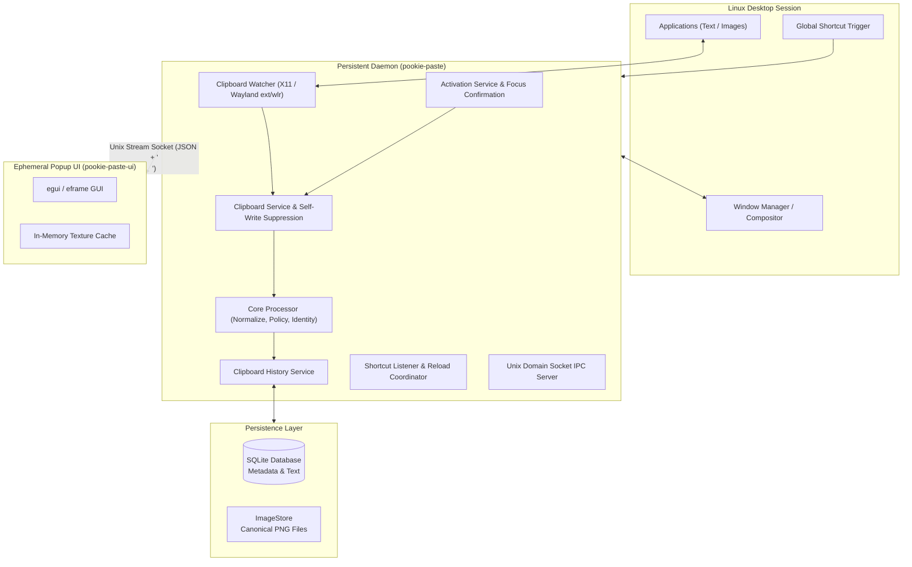

# Pookie Paste Architecture

Pookie Paste is a lightweight, native clipboard history application for Linux built with a two-tier process architecture: a long-running background daemon and an ephemeral popup UI.

It provides cross-desktop clipboard history, content preview, window focus restoration, synthetic paste injection, and global shortcut management across X11 and modern Wayland environments (KDE Plasma, Sway, Hyprland).

For comprehensive, subsystem-level implementation details, see the modular guides linked below.

---

## High-Level Architecture

```mermaid
flowchart TD
    subgraph Desktop["Linux Desktop Session"]
        Apps["Applications (Text / Images)"]
        Hotkey["Global Shortcut Trigger"]
        Compositor["Window Manager / Compositor"]
    end

    subgraph Daemon["Persistent Daemon (pookie-paste)"]
        direction TB
        Watcher["Clipboard Watcher (X11 / Wayland ext/wlr)"]
        ClipboardSvc["Clipboard Service & Self-Write Suppression"]
        Processor["Core Processor (Normalize, Policy, Identity)"]
        HistorySvc["Clipboard History Service"]
        ActivationSvc["Activation Service & Focus Confirmation"]
        ShortcutSvc["Shortcut Listener & Reload Coordinator"]
        IPCServer["Unix Domain Socket IPC Server"]

        Watcher --> ClipboardSvc
        ClipboardSvc --> Processor
        Processor --> HistorySvc
        ActivationSvc --> ClipboardSvc
    end

    subgraph Storage["Persistence Layer"]
        SQLite[("SQLite Database<br/>Metadata & Text")]
        ImageStore["ImageStore<br/>Canonical PNG Files"]
    end

    subgraph UI["Ephemeral Popup UI (pookie-paste-ui)"]
        Eframe["egui / eframe GUI"]
        Thumbnails["In-Memory Texture Cache"]
    end

    Apps <--> Watcher
    Hotkey --> Daemon
    Daemon <--> Compositor
    HistorySvc <--> Storage
    Daemon <-->|"Unix Stream Socket (JSON + '\n')"| UI
```

---

## Core Invariants

Pookie Paste is governed by strict architectural invariants across all subsystems:

1. **State Ownership Separation**: The UI contains no durable application state. SQLite records, image files, configuration state, platform handles, and watcher threads are owned strictly by the persistent daemon. The UI retains only transient view state.
2. **Canonical Image Representation & Pixel Identity**: Accepted clipboard images are decoded and converted to canonical PNG-encoded RGBA8 bytes for filesystem persistence, clipboard transfer, and UI rendering. Images are not identified by PNG byte hashes; stable deduplication and identity derive from decoded RGBA8 pixel bytes (`rgba-v1`). See [Clipboard Overview](clipboard/overview.md) for identity details.
3. **Self-Write Suppression**: Pookie-originated clipboard writes record a compact typed content fingerprint in memory. Subsequent platform change notifications matching this fingerprint are discarded once, preventing recursive feedback loops.
4. **Target Confirmation Before Paste**: Pookie never performs synthetic paste injection into an unconfirmed or unverified window. If no focus target was captured (`target = None`), activation halts before paste evaluation and returns `ClipboardUpdated`. If a target is captured but cannot be restored or confirmed, activation returns `PasteFailed`. Keystrokes are emitted only after focus confirmation succeeds.
5. **Compositor Non-Interference**: In compositor-managed environments (Sway, Hyprland), Pookie never silently modifies external compositor configuration files. Pookie records user intent in `config.toml`, while the compositor retains exclusive ownership over its live bindings.
6. **Portal Authority**: In desktop portal environments (KDE Plasma Wayland), the portal-reported effective shortcut is authoritative over `config.toml`.
7. **Local-Only Communication & Single-Instance Safety**: IPC uses local Unix domain stream sockets and runs under the daemon user's UID. Socket probing and binding provide daemon single-instance detection.

---

## Subsystem Overviews & Modular Documentation

Detailed technical documentation is organized into modular guides:

### 1. Clipboard Management
Monitors the desktop clipboard through event-driven platform watchers: XFixes on X11 (with lightweight generation fallback polling) and data-control protocols (`ext-data-control-v1`, `zwlr_data_control_v1`) on Wayland. Enforces strict MIME precedence (`image/*` → `text/uri-list` → genuine text), allowing a single local copied image file to enter history as an `Image` while rejecting generic non-image files. Handles content policy limits, text newline normalization, RGBA8 canonical PNG generation, and single-use self-write suppression using typed content fingerprints.
*Detailed guide: [**Clipboard Subsystem Overview**](clipboard/overview.md)*

### 2. History & Storage
Coordinates dual-layer persistence: SQLite serves as the authoritative store for item metadata, text content, item pinning, and typed content identities (`rgba-v1` for images, SHA-256 for text); `ImageStore` persists canonical PNG files referenced by application-relative paths (`images/<uuid>.png`). Intact duplicates are promoted in place, with missing image backing storage recovered from fresh copies if needed. The subsystem coordinates startup image store reconciliation to clean unreferenced files, maintains monotonic revision tracking so open UI instances refresh via IPC, and executes idempotent background migration of legacy image identities.
*Detailed guide: [**Clipboard & Storage Overview**](clipboard/overview.md)*

### 3. Activation, Focus & Direct Paste
Orchestrates the sequential activation lifecycle: content retrieval, desktop clipboard writeback, history promotion, target window focus restoration, 250ms focus confirmation polling, and synthetic Ctrl+V paste injection (via XTest, Portal RemoteDesktop/EIS, or wlroots virtual keyboard). If no focus target was captured (`target = None`), activation completes gracefully with `ClipboardUpdated` without evaluating paste. If a target is present but focus restoration or confirmation fails, activation returns `PasteFailed`. Under no circumstances are synthetic keystrokes emitted without a confirmed target.
*Detailed guide: [**Activation Subsystem Overview**](activation/overview.md)*
*Platform implementations: [X11](activation/platforms/x11.md) | [KDE Wayland](activation/platforms/kde-wayland.md) | [Sway](activation/platforms/sway.md) | [Hyprland](activation/platforms/hyprland.md)*

### 4. Global Shortcuts
Provides cross-desktop hotkey management supporting four distinct paradigms: native passive root grabs (X11), desktop portal sessions (KDE Plasma), compositor-managed keybindings (Sway, Hyprland), and unsupported safe mode. Supports transactional rebinding with automatic rollback, live read-only IPC inspection, preflight conflict detection, and rich status reporting.
*Detailed guide: [**Global Shortcuts Overview**](shortcuts/overview.md)*
*Status model: [Shortcut Status Model](shortcuts/status-model.md)*
*Platform implementations: [X11](shortcuts/platforms/x11.md) | [KDE Portal](shortcuts/platforms/kde-portal.md) | [Sway](shortcuts/platforms/sway.md) | [Hyprland](shortcuts/platforms/hyprland.md)*

### 5. Inter-Process Communication (IPC)
Defines the wire contract connecting the persistent daemon, ephemeral popup UI, and CLI commands. Uses newline-delimited JSON over local Unix domain stream sockets with a 1 MiB frame ceiling, 30-second read timeouts, typed Serde request/response protocols, and single-instance enforcement through socket probing and binding. Powers UI state synchronization via an initial `GetHistory` snapshot combined with revision-driven `WaitForHistoryChange` long-polling for live updates without redundant history fetching.
*Detailed guide: [**IPC Subsystem Overview**](ipc/overview.md)*

---

## Process & Runtime Model

The `pookie-paste` binary functions as either the persistent background daemon or a lightweight CLI client:

| Entry Point | Role | Description |
| --- | --- | --- |
| `pookie-paste` | Daemon | Starts background services, watchers, listeners, and the IPC server. |
| `pookie-paste --toggle` | Client | Requests popup display through the daemon while preserving single-instance UI behavior. |
| `pookie-paste --reload` | Client | Requests strict reload of `config.toml` in the running daemon. |
| `pookie-paste --shortcut-status` | Client | Queries and displays live shortcut configuration and runtime binding status. |

For detailed startup sequencing, signal handling (`SIGINT`, `SIGTERM`, `SIGHUP`), single-instance UI management (`UiLauncher`), and environment resolution:
*See: [**Runtime Model & Process Lifecycle**](architecture/runtime-model.md)*

---

## Crate Organization

The repository is organized into focused, modular crates within a single Cargo workspace:

| Crate | Responsibility | Documentation Reference |
| --- | --- | --- |
| [`crates/pookie-core`](../crates/pookie-core) | Domain models, policy limits, text normalization, and content identity routing. | [Clipboard Overview](clipboard/overview.md) |
| [`crates/pookie-clipboard`](../crates/pookie-clipboard) | Clipboard backends, event-driven watchers, MIME negotiation, and canonical image codec (`CanonicalImage`). | [Clipboard Overview](clipboard/overview.md) |
| [`crates/storage`](../crates/storage) | SQLite repository, schema migrations, and atomic filesystem image store. | [Clipboard Overview](clipboard/overview.md) |
| [`crates/history`](../crates/history) | High-level history service, in-place duplicate promotion, eviction, and revision change notification. | [Clipboard Overview](clipboard/overview.md) |
| [`crates/ipc`](../crates/ipc) | Unix domain socket transport, newline JSON codec, and typed protocol. | [IPC Overview](ipc/overview.md) |
| [`crates/daemon`](../crates/daemon) | Main background process, platform resolvers, backends, and coordinator. | [Runtime Model](architecture/runtime-model.md) |
| [`crates/ui`](../crates/ui) | Ephemeral popup GUI, egui rendering, input navigation, and thumbnail cache. | [Architecture Overview](architecture/overview.md) |

---

## Runtime Path Layout

Pookie Paste strictly follows the XDG Base Directory Specification:

| Path Category | Primary Location | Default Fallback | Purpose |
| --- | --- | --- | --- |
| **Data Directory** | `$XDG_DATA_HOME/pookie-paste/` | `~/.local/share/pookie-paste/` | Contains `pookie-paste.db` and `images/`. |
| **Config File** | `$XDG_CONFIG_HOME/pookie-paste/config.toml` | `~/.config/pookie-paste/config.toml` | User shortcut and application configuration. |
| **State File** | `$XDG_STATE_HOME/pookie-paste/` | `~/.local/state/pookie-paste/` | Runtime tokens (e.g. `remote-desktop.restore-token`). |
| **IPC Socket** | `$XDG_RUNTIME_DIR/pookie-paste/pookie.sock` | `/tmp/pookie-paste-<EUID>/pookie.sock` | Local Unix domain stream socket. |

---

## Platform Support

For the matrix of supported desktop environments, focus backends, paste injection mechanisms, shortcut ownership models, and known platform limitations:
*See: [**Platform Support Matrix**](platform-support.md)*