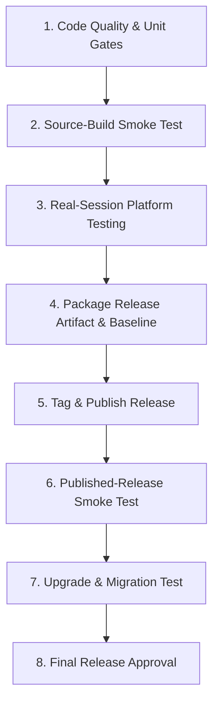

# Pookie Paste Release Testing Playbook

This document defines the release validation process for Pookie Paste Linux releases. It establishes the exact criteria, automated tests, manual platform verifications, packaging checks, and sign-off conditions required before publishing a release.

---

## 1. Release Validation Principles

1. **Clear Automated vs. Manual Boundary**: Deterministic installation, lifecycle, persistence, schema, and packaging contracts are automated in scripts and CI. Desktop session interactions (physical shortcuts, compositor window management, focus restoration, direct typing/pasting, and visual rendering) require real-session manual validation.
2. **Platform-Truthful Shortcuts**: Pookie does not assume a single shortcut model across Linux. Shortcut ownership differs across X11 (native grab), KDE Plasma (XDG Desktop Portal), and Sway/Hyprland (compositor-managed keybindings).
3. **Data Integrity Guarantee**: Standard uninstalls and updates must preserve user clipboard history, images, and configuration. Full removal occurs only upon explicit purge.
4. **No Phantom Support**: Releases are approved only for desktop platforms and distributions whose runtime compatibility has been directly validated against this playbook.

---

## 2. Release Workflow Sequence

Maintainers should follow this linear sequence when preparing a release:



---

## 3. Automated Pre-Release Gates

Before packaging or manual testing, all workspace compilation and static analysis gates must pass:

```bash
# 1. Format check
cargo fmt --all -- --check

# 2. Workspace compilation & dependency resolution
cargo check --workspace --all-targets

# 3. Lints with zero warnings allowed
cargo clippy --workspace --all-targets -- -D warnings

# 4. Full test suite execution
cargo test --workspace
```

Ensure git working tree is clean:

```bash
git status --porcelain
```

---

## 4. Automated Installation Lifecycle (Smoke Test)

Pookie Paste provides an automated end-to-end installation lifecycle test:

```bash
./scripts/smoke-test-install.sh --from-source
```

### 4.1 Environment Isolation Model

The smoke test isolates application data to prevent mutating the tester's personal clipboard history, database, or settings:

* **Redirected Variables**:
  * `HOME` → temporary sandbox directory
  * `XDG_DATA_HOME` → `$TEST_HOME/.local/share`
  * `XDG_CONFIG_HOME` → `$TEST_HOME/.config`
  * `XDG_STATE_HOME` → `$TEST_HOME/.local/state`
* **Preserved Runtime**:
  * Real `XDG_RUNTIME_DIR` is retained so the test daemon connects to the active graphical session (X11 or Wayland socket).
* **Toolchain Preservation**:
  * In `--from-source` mode, `CARGO_HOME` and `RUSTUP_HOME` point to the developer's real toolchain so Rust compilation succeeds while `HOME` is redirected.
* **Compositor & Onboarding Isolation**:
  * Sets `XDG_CURRENT_DESKTOP="PookieSmokeTest"` to intentionally suppress desktop-specific integrations (e.g., KWin script registration) during generic isolation testing.
  * Exports `POOKIE_SKIP_ONBOARDING=1` to suppress launching the interactive GUI shortcut setup window during fresh installation and reinstallation phases.

### 4.2 The 8-Phase Lifecycle Verification

`scripts/smoke-test-install.sh` validates the following phases sequentially:

1. **Preflight & Environment Isolation**:
   * Confirms Linux OS and active graphical display (`DISPLAY` or `WAYLAND_DISPLAY`).
   * Validates `XDG_RUNTIME_DIR`.
   * Enforces that no host `pookie-paste` daemon is running.
   * Constructs isolated directory trees.
2. **Fresh Installation**:
   * Installs daemon (`~/.local/bin/pookie-paste`) and UI (`~/.local/bin/pookie-paste-ui`).
   * Installs desktop entry (`~/.local/share/applications/io.github.riyanj220.PookiePaste.desktop`).
   * Installs autostart entry (`~/.config/autostart/io.github.riyanj220.PookiePaste-autostart.desktop`).
   * Installs the complete 6-asset Hicolor icon theme (`scalable`, `256x256`, `128x128`, `64x64`, `48x48`, `32x32`).
   * Verifies required metadata:
     * `Name=Pookie Paste`
     * `Exec=pookie-paste --toggle`
     * `Icon=io.github.riyanj220.PookiePaste`
     * `StartupWMClass=io.github.riyanj220.PookiePaste`
     * Autostart: `Exec=pookie-paste`, `NoDisplay=true`.
3. **Runtime Readiness & IPC Validation**:
   * Verifies the daemon starts and remains active.
   * Verifies SQLite database creation (`~/.local/share/pookie-paste/pookie-paste.db`).
   * Verifies default configuration bootstrapping (`~/.config/pookie-paste/config.toml`).
   * Verifies Unix domain socket connectivity (`$XDG_RUNTIME_DIR/pookie-paste/pookie.sock`).
   * Executes `pookie-paste --shortcut-status --porcelain` and verifies the output parses to a recognized status (`ready`, `needs_setup`, `conflict`, `bound_unverified`, `unavailable`) with a non-empty shortcut string.
4. **Persistence Sentinel Placement**:
   * Drops sentinel files into data, state, and config directories (`.smoke-data-sentinel`, `.smoke-state-sentinel`, `.smoke-config-sentinel`).
5. **Standard Uninstall (via root `./uninstall.sh`)**:
   * Executes the root bootstrap uninstaller.
   * Verifies daemon process terminates cleanly.
   * Verifies removal of binaries, desktop entry, autostart entry, and all 6 icon assets.
   * **Verifies Data Preservation**: Data directory, state directory, config directory, SQLite database, `config.toml`, and all sentinel files remain intact.
6. **Reinstallation & Persistence Verification**:
   * Reinstalls the application.
   * Verifies binaries, desktop entries, and icon assets are restored.
   * Confirms the daemon starts up and IPC communicates successfully.
   * Verifies pre-existing database, `config.toml`, and sentinel files survived reinstallation without truncation.
7. **Purge Uninstall (via root `./uninstall.sh --purge`)**:
   * Executes the root bootstrap uninstaller with `--purge`.
   * Verifies daemon termination, removal of binaries, desktop entries, and icon assets.
   * **Verifies Complete Wipe**: Data directory, state directory, config directory, database, configuration, and sentinels are completely removed.
8. **Idempotent Uninstall Verification**:
   * Runs `./scripts/uninstall.sh` and `./scripts/uninstall.sh --purge` against already-cleaned directories to guarantee uninstallation is safely idempotent and exits with status 0.

### 4.3 Debugging Failed Smoke Runs

To preserve the temporary sandbox for post-mortem analysis:

```bash
./scripts/smoke-test-install.sh --from-source --keep-temp
```

The script prints the preserved path upon exit (e.g. `/tmp/pookie-paste-smoke.XXXXXX`).

---

## 5. Post-Install Shortcut Onboarding Contract

The installer inspects the runtime daemon via `pookie-paste --shortcut-status --porcelain` to decide its onboarding flow. Maintainers must verify that installer output conforms to the authoritative status table:

| Porcelain Status | Human Terminal Message | Action Taken by Installer |
| :--- | :--- | :--- |
| `status=ready` | `Pookie Paste is ready. Press <shortcut> to open clipboard history.` | None. Does not open shortcut setup window. |
| `status=bound_unverified` | `Pookie Paste is installed. Shortcut binding detected. Press <shortcut> to test it.` | None. Does not force setup window. |
| `status=needs_setup` | `Pookie Paste is installed. Finish shortcut setup in the window that just opened.` | Invokes `pookie-paste --shortcut-setup` to launch the GUI onboarding flow. |
| `status=conflict` | `Pookie Paste is installed. <shortcut> is already in use. Choose another shortcut in the window that just opened.` | Invokes `pookie-paste --shortcut-setup` to allow the user to select an alternative. |
| `status=unavailable` | `Pookie Paste is installed, but the global shortcut is unavailable.` | Advises user to open Pookie Paste from the application menu. |

---

## 6. Manual Real-Session Platform Validation

The automated smoke test verifies lifecycle mechanics, but cannot press physical keys or interact with real display servers. Maintainers must manually validate each supported platform in a live session.

### 6.1 X11

X11 utilizes native window system passive key grabs (`XGrabKey`).

#### Verification Steps
1. **Fresh Install & Startup**:
   * Start the daemon: `pookie-paste`.
   * Verify native grab succeeds: `pookie-paste --shortcut-status --porcelain` reports `status=ready` and `shortcut=Super+V`.
2. **Physical Shortcut Activation**:
   * Press `Super+V`: verify the popup appears near the active cursor or window.
3. **Application Identity**:
   * Inspect the running popup with `xprop`:
     ```bash
     xprop WM_CLASS _NET_WM_ICON
     ```
   * Confirm `WM_CLASS` contains `"io.github.riyanj220.PookiePaste"`.
   * Confirm `_NET_WM_ICON` is present.
   * Confirm launcher and dock/taskbar display the official Pookie Paste icon (not a generic executable icon).
4. **Conflict Handling**:
   * Bind `Super+V` in another tool or window manager shortcut.
   * Restart Pookie: verify status surfaces as `status=conflict`.
5. **Dismissal Policy**:
   * Open the popup. Click an outside window or desktop surface.
   * Verify the popup dismisses on focus loss.

---

### 6.2 KDE Plasma Wayland

KDE Plasma delegates shortcut handling to the XDG Desktop Portal (`org.freedesktop.portal.GlobalShortcuts`).

> [!IMPORTANT]
> `config.toml` records the user's requested intent. The XDG GlobalShortcuts portal maintains the authoritative effective assignment.

#### Verification Steps
1. **Unconfigured Initial State**:
   * Remove previous portal authorization for Pookie Paste in KDE System Settings (Shortcuts).
   * Run installer or start daemon.
   * Verify porcelain output: `status=needs_setup`, `shortcut=Super+V`.
   * Verify UI indicates "No shortcut assigned" with a "[ Set shortcut ]" button.
2. **Configuring Portal Shortcut**:
   * Click "[ Set shortcut ]" or trigger `pookie-paste --shortcut-setup`.
   * In KDE's portal dialog, assign a shortcut (e.g. `Meta+V`).
   * Verify status updates immediately to `status=ready` and `shortcut=Meta+V`.
3. **Physical Shortcut & Paste Flow**:
   * Press `Meta+V`: confirm popup opens.
   * Activate an entry: verify `pookie-focus` restores target window focus, and direct paste injects via Portal/EIS.
4. **Live Portal Modifications (ShortcutsChanged)**:
   * Open KDE System Settings → Shortcuts. Change the shortcut from `Meta+V` to `Meta+Shift+V` without restarting Pookie Paste.
   * Confirm the daemon receives `ShortcutsChanged` over D-Bus and updates effective status without restart.
   * Clear the shortcut in System Settings: confirm status returns to `needs_setup` / `Unconfigured`.
5. **Dismissal Policy**:
   * Confirm clicking outside the popup dismisses it (focus-loss dismissal).
6. **Temporary Target Safety Edge Case**:
   * Open the KDE Application Launcher (Kickoff), press `Meta+V`, then dismiss Kickoff before activating an item in Pookie.
   * Confirm Pookie safely aborts direct paste rather than injecting keystrokes into an unintended window.

---

### 6.3 Sway (wlroots / i3-ipc)

Sway manages global bindings directly in `~/.config/sway/config`. Pookie never alters Sway configuration files directly.

#### Verification Steps
1. **Conflict Detection**:
   * Ensure `Mod4+v` is bound to Sway's default `splitv` in `~/.config/sway/config`.
   * Run `pookie-paste --shortcut-status --porcelain`.
   * Verify status reports `status=conflict` and provides the diagnostic snippet.
2. **Configuring Sway Binding**:
   * Add the canonical snippet to `~/.config/sway/config`:
     ```sway
     bindsym Mod4+v exec pookie-paste --toggle
     ```
   * Reload Sway: `swaymsg reload`.
   * Run `pookie-paste --shortcut-status --porcelain`: verify status reports `status=ready`.
3. **Physical Activation**:
   * Press `Mod4+v`: verify popup opens.
   * Activate an item: verify focus restores via Sway IPC, and text pastes via `zwp_virtual_keyboard_v1`.
4. **Config/Runtime Mismatch**:
   * If `config.toml` specifies `Super+H` while Sway config has `Mod4+v`, verify Pookie surfaces the discrepancy in the UI settings view rather than falsely claiming the shortcut is synchronized.
5. **Dismissal Policy**:
   * Sway uses explicit dismissal. Verify:
     * Moving the pointer outside the window does **not** close the popup.
     * Clicking an underlying application does **not** close the popup.
     * Pressing `Escape` closes the popup.
     * Clicking the close button (`✕`) closes the popup.
     * Activating an item closes the popup.

---

### 6.4 Hyprland

Hyprland manages global bindings in `hyprland.conf` or `hyprland.lua`. Pookie queries live bindings via Hyprland IPC (`j/binds`).

#### Verification Steps
1. **Opaque Lua Callback Contract (`bound_unverified`)**:
   * When using modern Lua configurations (`hl.bind("SUPER + V", ...)`), Hyprland registers an opaque `__lua` dispatcher.
   * Run `pookie-paste --shortcut-status --porcelain`.
   * **Verify**: Status is reported as `status=bound_unverified`.
   * **Contract**: This is treated as valid and operational. The UI must not show error banners or force the onboarding setup window.
   * Press `Super+V`: confirm the binding launches the popup.
2. **Standard Hyprlang Binding**:
   * In `hyprland.conf`:
     ```hyprlang
     bind = SUPER, V, exec, pookie-paste --toggle
     ```
   * Verify status reports `status=ready`.
3. **Missing Binding Flow**:
   * Remove the binding and reload Hyprland: verify status reports `status=needs_setup`.
4. **Dismissal Policy**:
   * Hyprland uses explicit dismissal. Verify pointer movement and outside clicks do not close the popup; verify `Escape`, the header close button, or item activation closes it.

---

## 7. Application Identity & Desktop Integration

Verify that Pookie Paste integrates cleanly into the desktop shell without generic placeholder icons or window grouping defects.

### 7.1 Asset Verification
Confirm installed assets in `~/.local/share/icons/hicolor/`:
* `scalable/apps/io.github.riyanj220.PookiePaste.svg`
* `256x256/apps/io.github.riyanj220.PookiePaste.png`
* `128x128/apps/io.github.riyanj220.PookiePaste.png`
* `64x64/apps/io.github.riyanj220.PookiePaste.png`
* `48x48/apps/io.github.riyanj220.PookiePaste.png`
* `32x32/apps/io.github.riyanj220.PookiePaste.png`

### 7.2 Desktop & Window Attributes
* Desktop file: `Icon=io.github.riyanj220.PookiePaste`
* Window identity: `StartupWMClass=io.github.riyanj220.PookiePaste`
* Wayland application ID: `io.github.riyanj220.PookiePaste`
* Embedded window icon: Built directly into the UI binary (`assets/pookie-paste-128.png`).

### 7.3 Visual Inspection
1. **Application Launcher**: Search for "Pookie Paste" in Kickoff, Rofi, Wofi, or GNOME/XFCE menus. Confirm the official icon renders crisply.
2. **Taskbar & Dock**: Open the popup or shortcut settings window. Verify the taskbar or dock displays the branded icon, not an generic Wayland/eframe cog or X11 placeholder.
3. **Window Grouping**: Confirm multiple windows or re-opens group under `io.github.riyanj220.PookiePaste`.

---

## 8. Core Clipboard & Activation Validation

Execute this sequence on each supported display server:

### 8.1 Mixed Content History & Promotion
1. Copy text entry A (`"Alpha"`).
2. Copy image entry A (e.g. take a screenshot or copy from an image viewer).
3. Copy text entry B (`"Beta"`).
4. Copy image entry B.
5. Open Pookie Paste (`Super+V`).
6. Confirm visual order (newest first):
   1. Image B
   2. Text B (`"Beta"`)
   3. Image A
   4. Text A (`"Alpha"`)
7. Confirm image thumbnails render with preserved aspect ratios.
8. Activate Image A into an image-capable target (e.g. GIMP, LibreOffice, or web chat).
   * Verify Image A pastes directly.
   * Reopen `Super+V`: verify Image A is promoted to position 1.
   * Verify no duplicate history entries were created.
9. Activate Text A into a text editor.
   * Verify Text A pastes directly.
   * Reopen `Super+V`: verify Text A is now position 1.

### 8.2 Self-Write Duplicate Suppression
1. Activate an item from Pookie Paste.
2. Confirm that writing to the system clipboard during activation does not record a new identical item in the history database.

### 8.3 Content Transitions
Alternate copying between binary image data and UTF-8 text strings:
```text
Text → Image → Text → Image
```
Check daemon logs (`~/.local/state/pookie-paste/install-start.log` or stderr) to ensure no repeated MIME decoding crashes or unhandled error loops occur.

---

## 9. User State & Persistence Lifecycle

### 9.1 Filesystem Contract
User state is strictly partitioned across standard XDG locations:

```text
$XDG_CONFIG_HOME/pookie-paste/
└── config.toml

$XDG_DATA_HOME/pookie-paste/
├── pookie-paste.db
└── images/
    └── <uuid>.png

$XDG_STATE_HOME/pookie-paste/
└── install-start.log
```

### 9.2 Lifecycle Matrix

| Operation | Binaries & Desktop Entries | Hicolor Icons | Database & Images | Config (`config.toml`) |
| :--- | :---: | :---: | :---: | :---: |
| **Standard Uninstall** | Removed | Removed | **Preserved** | **Preserved** |
| **Reinstall / Update** | Replaced | Replaced | **Preserved** | **Preserved** |
| **Purge (`--purge`)** | Removed | Removed | **Deleted** | **Deleted** |

> [!NOTE]
> Pookie Paste does not manipulate or delete external portal authorization records maintained by desktop portals in system databases.

---

## 10. Distribution & Release Artifact Validation

Release packages are generated using:

```bash
./scripts/package-release.sh <version> [architecture]
```

### 10.1 Archive Contents Inspection
Unpack and verify the generated tarball:

```bash
tar -tzf dist/pookie-paste-<version>-linux-x86_64.tar.gz
```

The archive must contain exactly:

```text
pookie-paste-<version>-linux-x86_64/
├── bin/
│   ├── pookie-paste
│   └── pookie-paste-ui
├── share/
│   ├── applications/
│   │   └── io.github.riyanj220.PookiePaste.desktop
│   ├── autostart/
│   │   └── io.github.riyanj220.PookiePaste-autostart.desktop
│   ├── icons/
│   │   └── hicolor/
│   │       ├── 128x128/apps/io.github.riyanj220.PookiePaste.png
│   │       ├── 256x256/apps/io.github.riyanj220.PookiePaste.png
│   │       ├── 32x32/apps/io.github.riyanj220.PookiePaste.png
│   │       ├── 48x48/apps/io.github.riyanj220.PookiePaste.png
│   │       ├── 64x64/apps/io.github.riyanj220.PookiePaste.png
│   │       └── scalable/apps/io.github.riyanj220.PookiePaste.svg
│   └── pookie-paste/
│       └── kwin/
│           └── pookie-focus/
├── LICENSE
├── README.md
└── RELEASE_VERSION
```

**Negative Contract**: Runtime-generated files (`config.toml`, `pookie-paste.db`, image cache, sockets) must **never** be included in the release archive.

### 10.2 Checksum Verification
Verify the generated checksum file:

```bash
cd dist
sha256sum -c SHA256SUMS
```

Ensure the output confirms:
```text
pookie-paste-<version>-linux-x86_64.tar.gz: OK
```

### 10.3 Dynamic Runtime Compatibility Baseline
Inspect the compiled binaries inside the extracted package:

```bash
cd dist/pookie-paste-<version>-linux-x86_64/bin

# Check dynamic linkage
ldd pookie-paste
ldd pookie-paste-ui

# Inspect glibc symbol requirements
objdump -T pookie-paste | grep -o 'GLIBC_[0-9.]*' | sort -V | tail -n 1
objdump -T pookie-paste-ui | grep -o 'GLIBC_[0-9.]*' | sort -V | tail -n 1
```

Confirm that the required GLIBC version does not exceed the target deployment baseline (e.g. GLIBC 2.31 or 2.35 as specified in release requirements).

---

## 11. Published-Release & Upgrade Testing

### 11.1 Published-Release Smoke Test
Once the GitHub release tag is published, validate the exact downloadable archive:

```bash
# Test specific published release
./scripts/smoke-test-install.sh --version <version>

# Test latest published release
./scripts/smoke-test-install.sh
```

### 11.2 Upgrade Verification Over Previous Version
To guarantee that real upgrades do not break live user environments, execute upgrade verification in a dedicated clean user account or test machine (never via the smoke test, which purges the test sandbox upon completion):

1. **Install Previous Published Release**:
   Install the previous stable release normally:
   ```bash
   ./install.sh --version <previous-version>
   ```
2. **Populate Representative User State**:
   * Copy multiple text snippets into clipboard history.
   * Copy multiple image entries (verify image files are written to `$XDG_DATA_HOME/pookie-paste/images/`).
   * Configure custom settings and a non-default shortcut intent in `~/.config/pookie-paste/config.toml`.
3. **Install Candidate Release Over Existing Installation**:
   Run the candidate release installer directly over the existing environment:
   ```bash
   # From candidate release archive:
   ./install.sh

   # Or from source tree:
   ./scripts/install.sh --from-source
   ```
4. **Verify Upgrade Integrity**:
   * **Persistence**: SQLite database, image files, `config.toml`, and configured shortcut intent survive intact without truncation or corruption.
   * **Resource Updates**: Binaries in `~/.local/bin/`, desktop entries in `~/.local/share/applications/`, and icon assets in `~/.local/share/icons/hicolor/` are updated to candidate versions.
   * **Runtime Readiness**: The daemon restarts cleanly and responds over the IPC socket.
   * **Functionality**: Existing pre-upgrade text and image entries load properly, render thumbnails accurately, and still activate and paste into target applications without error.

### 11.3 Remote Bootstrap Verification
Verify that remote one-line installation and uninstallation function properly:

```bash
# 1. Fresh install
curl -fsSL https://raw.githubusercontent.com/riyanj220/pookie-paste/main/install.sh | bash

# 2. Update (re-running install)
curl -fsSL https://raw.githubusercontent.com/riyanj220/pookie-paste/main/install.sh | bash

# 3. Standard remote uninstall
curl -fsSL https://raw.githubusercontent.com/riyanj220/pookie-paste/main/uninstall.sh | bash

# 4. Full remote purge
curl -fsSL https://raw.githubusercontent.com/riyanj220/pookie-paste/main/uninstall.sh | bash -s -- --purge
```

---

## 12. Release Approval Checklist

A release is approved **only** when all checkboxes below are satisfied:

### Automated Pre-Release Gates
- [ ] `cargo fmt --all -- --check` passes with zero discrepancies.
- [ ] `cargo check --workspace --all-targets` passes.
- [ ] `cargo clippy --workspace --all-targets -- -D warnings` passes with zero warnings.
- [ ] `cargo test --workspace` passes all unit and integration tests.
- [ ] `./scripts/smoke-test-install.sh --from-source` passes all 8 phases.

### Real-Session Desktop Validation
- [ ] **X11**: Native key grab functions; click-outside dismisses; `_NET_WM_ICON` & `WM_CLASS` valid.
- [ ] **KDE Plasma Wayland**: Portal status tracking (`needs_setup` vs `ready`); live `ShortcutsChanged` reflection; `pookie-focus` focus restoration and EIS paste succeed.
- [ ] **Sway**: Live IPC conflict detection surfaces; snippet binding works; explicit dismissal policy verified.
- [ ] **Hyprland**: `bound_unverified` handled gracefully without false alarms; Lua and Hyprlang bindings work; explicit dismissal policy verified.

### Identity & UX Integration
- [ ] Complete Hicolor icon theme installed (`scalable`, `256`, `128`, `64`, `48`, `32`).
- [ ] Desktop launcher, taskbar, dock, and Alt-Tab display branded icon without generic fallbacks.
- [ ] Installer onboarding messages conform to the porcelain status matrix.

### Clipboard Core Contracts
- [ ] Mixed text/image capture orders correctly.
- [ ] Image thumbnails render with accurate aspect ratios.
- [ ] Item activation promotes entry to top without duplicate history rows.
- [ ] Direct paste reliably restores previous window focus before keystroke injection.

### Persistence & Packaging
- [ ] Standard uninstall preserves database, images, and `config.toml`.
- [ ] Purge uninstall completely cleans database, images, and `config.toml`.
- [ ] Release archive contains binaries, desktop entries, autostart, kwin scripts, and hicolor icons.
- [ ] Release archive contains no runtime databases, configs, or image caches.
- [ ] `dist/SHA256SUMS` verified against generated packages.
- [ ] Dynamic library linkage and GLIBC baseline inspected and verified.
- [ ] Upgrading over the previous stable release preserves database and user settings.
- [ ] Published release smoke test passes: `./scripts/smoke-test-install.sh --version <version>`.