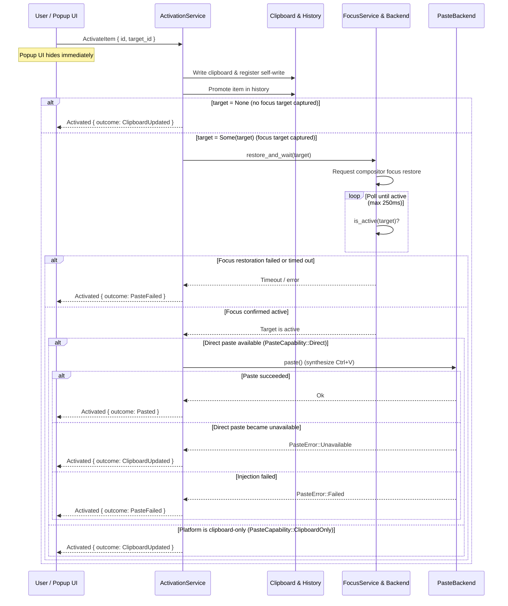

# Activation, Focus Restoration & Paste

This document describes the activation lifecycle in Pookie Paste: how a user selection in the popup UI transitions into clipboard writeback, history promotion, window focus restoration, target confirmation, and synthetic paste injection.

---

## Core Invariant

> **Pookie never injects paste into an unconfirmed target.**

This invariant is strictly enforced by production code:
* If no focus target was captured prior to activation (`target = None`), activation halts immediately before paste capability evaluation and returns `ClipboardUpdated`. No synthetic paste is attempted.
* If a focus target was captured (`target = Some(target)`), synthetic keystroke injection is dispatched only after `FocusService` confirms that the target window has become active.
* If focus restoration fails or times out within 250ms, the operation terminates with `PasteFailed`. Keystrokes are never emitted into an unverified or unknown window.

---

## Architecture & Responsibilities

Activation coordinates multiple daemon subsystems and platform interfaces:

* **`ClipboardActivationService`** ([`crates/daemon/src/activation_service.rs`](../../crates/daemon/src/activation_service.rs)): Coordinates the complete activation sequence: content retrieval, clipboard writeback, history promotion, focus restoration request, and paste dispatch.
* **`FocusService`** ([`crates/daemon/src/focus_service.rs`](../../crates/daemon/src/focus_service.rs)): Drives the focus restoration polling loop. It delegates to the active platform `FocusBackend` and enforces confirmation within a 250ms deadline.
* **`FocusBackend`** ([`crates/daemon/src/focus_backend.rs`](../../crates/daemon/src/focus_backend.rs)): Trait implemented by platform-specific focus modules (X11, KDE KWin, Sway, Hyprland) providing active window capture, focus restoration, and active state verification.
* **`PasteBackend`** ([`crates/daemon/src/paste_backend.rs`](../../crates/daemon/src/paste_backend.rs)): Trait implemented by input injection modules (X11 XTest, Wayland Portal/EIS, wlroots virtual keyboard) that synthesize Ctrl+V key events.
* **`IpcFocusTarget`** ([`crates/ipc/src/protocol.rs`](../../crates/ipc/src/protocol.rs)): Strongly typed IPC representation of target window identity transferred between the UI and daemon.

---

## Activation Lifecycle

The complete activation flow progresses through seven distinct stages:

### 1. Pre-Popup Target Capture
Before creating and displaying the popup window, the UI process requests `CaptureFocusTarget` from the daemon over IPC. The daemon queries the active platform focus backend and returns an `IpcFocusTarget`. This captures the window that currently owns user focus *before* the popup appears and claims window manager focus.

### 2. Content Retrieval & Canonicalization
When the user activates an item (via `Enter` on a selected item or clicking an item card), the UI issues `ActivateItem { id, target_id }` and immediately hides itself (`Visible(false)`). The daemon loads the item from storage:
* Text items are loaded directly from SQLite.
* Image items load the canonical PNG bytes from `ImageStore` and re-validate them through `canonicalize_image()` to ensure payload integrity before writeback. If the image file is missing or corrupted, activation terminates with `UnsupportedContent`.

### 3. Clipboard Writeback & Suppression Registration
The daemon writes the content to the desktop clipboard through `ClipboardService`. Upon successful write, `ClipboardService` immediately records a `ClipboardFingerprint` in `ClipboardState`. When the background clipboard watcher subsequently receives the platform clipboard change notification, the fingerprint matches and the event is dropped without entering history.

### 4. History Promotion
The item's timestamp is updated in SQLite via `ClipboardHistoryService::promote()`, moving the activated item to the top of the history list. If the item was removed between selection and promotion, activation returns `NotFound`.

### 5. Focus Target Verification & Restoration Request
Direct paste strictly requires a known, confirmed destination window:
* **No Target Captured (`target = None`)**: If target capture failed or was omitted prior to opening the popup:
  * Activation stops immediately before paste capability evaluation.
  * The daemon returns `ActivationOutcome::ClipboardUpdated`.
  * No focus restoration is attempted, and no synthetic paste is attempted or called.
* **Target Present (`target = Some(target)`)**: `FocusService` issues a restoration request to the active platform focus backend and begins active window verification. The restoration mechanism differs across window managers and compositors (e.g. `_NET_ACTIVE_WINDOW` on X11, KWin script shortcuts on KDE, IPC commands on Sway/Hyprland).

### 6. Focus Confirmation
Focus change is asynchronous in modern window managers and Wayland compositors. Rather than blindly injecting keystrokes immediately after sending a focus command, `FocusService` enters a confirmation loop:
* Polling interval: **5ms** (`FOCUS_POLL_INTERVAL`).
* Timeout ceiling: **250ms** (`FOCUS_TIMEOUT`).
* On each tick, `backend.is_active(target)` verifies whether the compositor has actually made the target window active.
* If the target does not become active within 250ms, `restore_and_wait()` returns an error, and the activation pipeline terminates with `PasteFailed`.

### 7. Synthetic Paste Injection
Synthetic paste injection is reached **only** after focus on a confirmed target window has been verified by `FocusService`. The daemon then evaluates `paste_backend.capability()`:
* **`PasteCapability::Direct`**: The paste backend emits synthetic Ctrl+V key press and release events into the confirmed window. If the backend reports `PasteError::Unavailable` between capability check and paste, activation degrades gracefully to `ClipboardUpdated`. If injection returns an error, activation reports `PasteFailed`.
* **`PasteCapability::ClipboardOnly`**: If direct paste is not supported or was disabled, activation succeeds with `ClipboardUpdated`. The user pastes manually using standard shortcuts.

---

## Activation Outcomes

The daemon returns an explicit `ActivationOutcome` enum to the caller:

| Outcome | Meaning | Clipboard State | Paste Emitted |
| --- | --- | :---: | :---: |
| **`Pasted`** | Focus was confirmed on the target window and synthetic Ctrl+V was successfully injected. | Updated & Promoted | Yes |
| **`ClipboardUpdated`** | Item written to clipboard and promoted, but direct paste was not emitted (no focus target was captured, platform is in `ClipboardOnly` mode, or direct paste became unavailable). | Updated & Promoted | No |
| **`PasteFailed`** | Target focus restoration failed or timed out, or synthetic key emission returned an error. | Updated & Promoted | No |
| **`NotFound`** | The requested history item ID does not exist in storage (or was deleted). | Unchanged | No |
| **`UnsupportedContent`** | Stored record contains missing text, missing image file on disk, or corrupted payload. | Unchanged | No |

---

## Target Confirmation Rationale

Target confirmation prevents Pookie from issuing synthetic paste input unless a confirmed target is observed as active:

1. **Wrong-Target Protection**: When activating an item, the window that owned focus prior to opening the popup must be restored and verified. If no target was captured, or if the window manager fails to switch focus, omitting confirmation would cause Ctrl+V to be delivered to whatever window happens to be active.
2. **Shell & Terminal Safety**: Unintended keystrokes delivered to terminal emulators or command prompts can trigger unexpected control sequences or accidental command execution.
3. **Predictable Degradation**: When no target is present or target confirmation fails, the clipboard remains updated with the selected item. The user can paste manually using standard shortcuts without data loss or unintended keystroke injection.

---

## Platform Implementations

Focus restoration and paste injection are platform-specific. See the dedicated guides for implementation details:

* [**X11**](platforms/x11.md): `_NET_ACTIVE_WINDOW` capture/restore and XTest key event simulation.
* [**KDE Wayland**](platforms/kde-wayland.md): KWin D-Bus helper UUID tracking and XDG Desktop Portal RemoteDesktop / EIS paste.
* [**Sway**](platforms/sway.md): Sway IPC tree traversal (`con_id`) and `zwp_virtual_keyboard_v1` injection.
* [**Hyprland**](platforms/hyprland.md): Hyprland IPC socket address tracking and `zwp_virtual_keyboard_v1` injection.

---

## Related Documentation

* [**Architecture Overview**](../architecture/overview.md): High-level system structure, architectural boundaries, and crate organization.
* [**Runtime Model**](../architecture/runtime-model.md): Multi-process lifecycle, memory usage, and background threads.
* [**Clipboard Overview**](../clipboard/overview.md): Clipboard writeback and self-write suppression markers.
* [**Shortcut Overview**](../shortcuts/overview.md): Hotkey trigger mechanisms initiating popup display.
* [**IPC Overview**](../ipc/overview.md): Request routing for `CaptureFocusTarget` and `ActivateItem`.

---

## Implementation References

| Component | Responsibility | Repository File Path |
| --- | --- | --- |
| **Activation Service** | Orchestration of retrieval, writeback, focus, and paste | [`crates/daemon/src/activation_service.rs`](../../crates/daemon/src/activation_service.rs) |
| **Focus Service** | 5ms/250ms polling loop and confirmation enforcement | [`crates/daemon/src/focus_service.rs`](../../crates/daemon/src/focus_service.rs) |
| **Focus Backend Trait** | Target identity and platform focus interface | [`crates/daemon/src/focus_backend.rs`](../../crates/daemon/src/focus_backend.rs) |
| **Paste Backend Trait** | Input synthesis capability and dispatch interface | [`crates/daemon/src/paste_backend.rs`](../../crates/daemon/src/paste_backend.rs) |
| **Platform Resolvers** | Session audit and backend pairing logic | [`crates/daemon/src/platform/resolvers.rs`](../../crates/daemon/src/platform/resolvers.rs) |
| **IPC Protocol** | `ActivateItem`, `IpcFocusTarget`, and `ActivationOutcome` | [`crates/ipc/src/protocol.rs`](../../crates/ipc/src/protocol.rs) |
| **UI Activation Trigger** | Pre-popup focus capture and activation invocation | [`crates/ui/src/main.rs`](../../crates/ui/src/main.rs), [`crates/ui/src/app.rs`](../../crates/ui/src/app.rs) |
