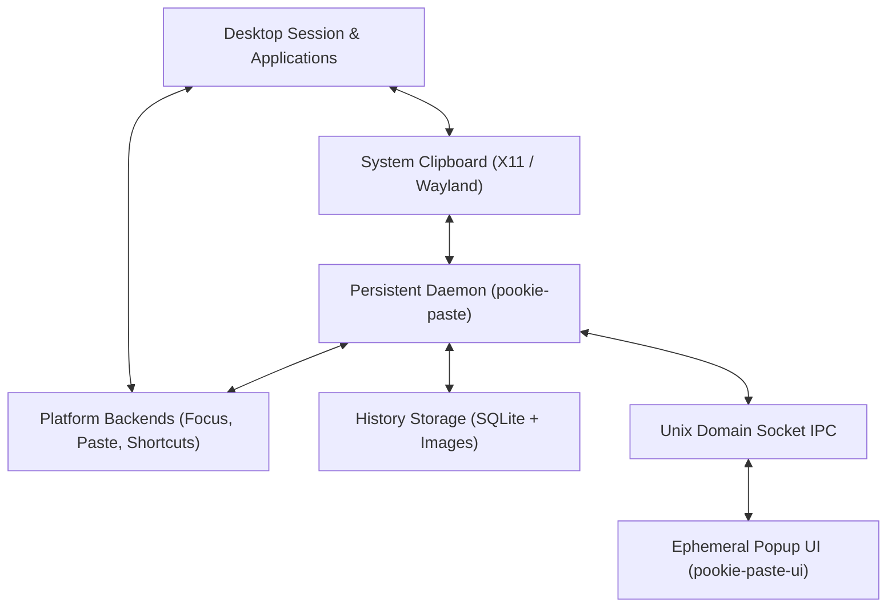

# Architecture Overview

Pookie Paste is a native, lightweight clipboard history application for Linux inspired by Windows Clipboard History. It enables users to browse clipboard history, preview text and images, and immediately restore and paste selections back into the active application.

The project is designed to be minimal, native, fast, and reliable across X11 and diverse Wayland environments (KDE Plasma, Sway, Hyprland).

---

## Process Architecture

Pookie Paste splits responsibilities between two separate processes:

1. **Persistent Daemon (`pookie-paste`)**: A long-running background service that owns clipboard monitoring, persistence, image file storage, platform backends (focus capture, paste injection, shortcut listener), and a local Unix IPC server.
2. **Ephemeral Popup UI (`pookie-paste-ui`)**: A short-lived graphical window built with `eframe`/`egui`. It contains no durable application state and communicates with the daemon exclusively over local Unix domain socket IPC.

---

## Architectural Boundaries

The codebase enforces strict boundaries so that platform-specific windowing and compositor quirks do not leak into history, storage, or UI presentation:

* **Persistent vs. Ephemeral State**:
  The UI does not own durable application state that must survive popup termination. All persistent clipboard history, configuration state, platform handles, and active watcher sessions are owned strictly by the daemon. The UI retains only transient view state (such as active search queries, navigation indices, and in-memory thumbnail textures).
* **Storage Separation**:
  Structured history metadata and text entries reside in a local SQLite database, whereas raw image bytes are stored as canonical PNG files on the filesystem. Database rows reference images via application-relative paths (`images/<uuid>.png`), keeping stored data independent of user home directories.
* **IPC Decoupling**:
  The UI does not access SQLite or clipboard APIs directly. History metadata comes through daemon IPC. Raw image payloads never traverse the socket wire; instead, the UI resolves and loads backing image files locally from the daemon-managed image store on the filesystem using the application-relative path supplied in history metadata (`images/<uuid>.png`), decoding and caching thumbnail textures in GPU memory on demand.
* **Platform Abstraction**:
  Desktop-specific behavior is isolated behind unified Rust traits:
  * `ClipboardBackend` and `ClipboardWatcher` for clipboard I/O and change notifications.
  * `FocusBackend` for capturing and restoring target application focus.
  * `PasteBackend` for synthesizing paste keystrokes.
  * `ShortcutBackend` for registering global hotkeys.

---

## Core Subsystems

Pookie Paste is structured into five main functional subsystems, each documented in detail in its respective section:

### 1. Clipboard Management
Monitors the system clipboard using event-driven platform watchers (XFixes with fallback polling on X11, data-control protocols on Wayland). Negotiates content formats via strict MIME precedence (direct image → `text/uri-list` → genuine text), canonicalizes accepted images into canonical PNG-encoded RGBA8 payloads, assigns stable typed content identities (`rgba-v1` for images, SHA-256 for text), and suppresses self-writes using typed content fingerprints.
*Detailed guide: [Clipboard Overview](../clipboard/overview.md)*

### 2. History & Storage
Coordinates dual-layer persistence: SQLite for authoritative metadata, text content, item pinning, and content identities; and an atomic filesystem `ImageStore` for canonical PNG images. Promotes intact duplicates in place (recovering missing backing files from fresh copies if needed), tracks monotonic revisions for live UI updates, reconciles unreferenced images on startup, and runs idempotent background migration of legacy image identities.
*Detailed guide: [Clipboard Overview](../clipboard/overview.md)*

### 3. Activation & Direct Paste
Governs what happens when a history item is selected. It executes a strict chronological sequence: content retrieval, clipboard writeback, history timestamp promotion, target window focus restoration, authoritative target confirmation, and synthetic paste injection.
*Detailed guide: [Activation Overview](../activation/overview.md)*

### 4. Global Shortcuts
Provides cross-desktop shortcut handling across three distinct paradigms: native key grabs (X11), desktop portals (KDE Plasma), and compositor-managed keybindings (Sway, Hyprland). Supports live configuration reloads, observational status rechecks, and conflict detection.
*Detailed guide: [Shortcuts Overview](../shortcuts/overview.md)*

### 5. Inter-Process Communication (IPC)
Provides typed, framed wire communication over local Unix domain stream sockets between the persistent daemon, ephemeral popup UI, and CLI commands. Powers live UI synchronization through initial snapshot loading and revision-driven change notifications (`WaitForHistoryChange`), enforces frame ceilings and read timeouts, and ensures daemon single-instance safety.
*Detailed guide: [IPC Overview](../ipc/overview.md)*

---

## Crate Organization

The repository is organized as a Cargo workspace with distinct crate boundaries:

| Crate | Responsibility |
| --- | --- |
| [`crates/pookie-core`](../../crates/pookie-core) | Core domain types, text normalization, policy enforcement, and content identity routing. |
| [`crates/pookie-clipboard`](../../crates/pookie-clipboard) | Clipboard backends, event-driven watchers, MIME negotiation, and canonical image codec (`CanonicalImage` / `ImageIdentity`). |
| [`crates/storage`](../../crates/storage) | SQLite repository, schema migrations, and atomic filesystem `ImageStore`. |
| [`crates/history`](../../crates/history) | High-level `ClipboardHistoryService`, eviction policy, in-place duplicate promotion, item pinning, and revision change notification. |
| [`crates/ipc`](../../crates/ipc) | Unix domain socket transport, newline JSON framing codec, typed protocol messages, and revision watch queries. |
| [`crates/daemon`](../../crates/daemon) | Main background process, platform resolvers, focus/paste/shortcut backends, and IPC request handler. |
| [`crates/ui`](../../crates/ui) | Ephemeral popup GUI, egui rendering, input navigation, thumbnail cache, and shortcut view. |

---

## Next Steps

To explore the runtime lifecycle, process model, or specific subsystem architectures:
* [Runtime Model & Process Lifecycle](runtime-model.md)
* [Clipboard & History Subsystem](../clipboard/overview.md)
* [Activation & Paste Subsystem](../activation/overview.md)
* [Global Shortcuts Subsystem](../shortcuts/overview.md)
* [IPC Subsystem](../ipc/overview.md)
