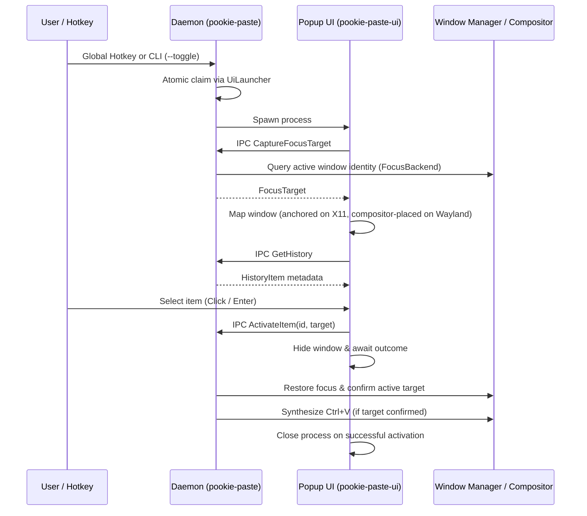

# Runtime Model & Process Lifecycle

This document describes the operational lifecycle, process interaction, singleton management, and filesystem conventions of Pookie Paste.

---

## Process Overview

Pookie Paste operates using a two-tier process architecture:



### State Ownership Precision
The UI does not own durable application state that must survive popup termination. Persistent clipboard history, image files, configuration state, platform handles, and background watchers are owned strictly by the daemon. While running, the UI maintains only transient runtime view state, such as:
* The active search and filter query.
* Current keyboard navigation index.
* Active view mode (clipboard history vs. shortcut setup).
* An in-memory GPU texture cache ([`ImageThumbnailCache`](../../crates/ui/src/image_thumbnail.rs)) for displayed image items.

---

## CLI Modes & Entry Points

The `pookie-paste` binary serves as both the persistent background daemon and the command-line control client depending on passed flags:

| Command | Action | Implementation |
| --- | --- | --- |
| `pookie-paste` | Starts the persistent background daemon service. | [`crates/daemon/src/main.rs`](../../crates/daemon/src/main.rs) |
| `pookie-paste -t, --toggle` | Requests popup display through the daemon while preserving single-instance UI behavior. | [`crates/daemon/src/cli.rs`](../../crates/daemon/src/cli.rs) |
| `pookie-paste -r, --reload` | Requests strict reload of `config.toml` in the running daemon. | [`crates/daemon/src/cli.rs`](../../crates/daemon/src/cli.rs) |
| `pookie-paste --shortcut-status` | Authoritatively queries and formats live global shortcut configuration and runtime binding status. | [`crates/daemon/src/cli.rs`](../../crates/daemon/src/cli.rs) |
| `pookie-paste -h, --help` | Displays usage instructions and available options. | [`crates/daemon/src/cli.rs`](../../crates/daemon/src/cli.rs) |
| `pookie-paste -V, --version` | Prints the application version. | [`crates/daemon/src/cli.rs`](../../crates/daemon/src/cli.rs) |

> [!NOTE]
> `--toggle` is named historically but does not implement a true visibility toggle (i.e. it does not close an already visible popup). If the popup is already running, the daemon preserves the existing window and returns `UiLaunchOutcome::AlreadyRunning`. On X11, an open popup may close on an external click or hotkey due to native window focus-loss semantics, but Wayland compositors do not have an explicit daemon-driven close mechanism.

---

## Daemon Lifecycle

### 1. Singleton Enforcement & Socket Binding
On launch, the daemon attempts to bind the Unix domain socket at `$XDG_RUNTIME_DIR/pookie-paste/pookie.sock`. Before binding:
1. It inspects whether the path already exists.
2. It attempts a test connection (`std::os::unix::net::UnixStream::connect`).
3. If the connection succeeds, another daemon instance is already active; the new process logs an informational message and exits with status 0.
4. If the connection is refused, the socket file is stale from a previous unclean shutdown; the daemon removes the file and proceeds to bind.

For complete wire protocol and stale socket cleanup mechanics, see [IPC Overview](../ipc/overview.md).

### 2. Startup Sequence
Once the socket is acquired, the daemon initializes in strict dependency order:
1. **Socket Binding & Singleton Check**: Binds the Unix IPC socket and clears stale socket files before allocating services.
2. **App Paths & Storage**: Verifies `$XDG_DATA_HOME/pookie-paste/` exists, connects to SQLite (`pookie-paste.db`), and runs schema migrations.
3. **Orphan Image Reconciliation**: Scans `$XDG_DATA_HOME/pookie-paste/images/` and unlinks any unreferenced PNG or leftover temporary files.
4. **Environment Audit**: Evaluates `XDG_SESSION_TYPE` and `XDG_CURRENT_DESKTOP`.
5. **Clipboard Service & Watcher**: Resolves the platform clipboard backend and launches the continuous event watcher.
6. **Focus Backend**: Resolves the platform focus backend (`X11`, `KDE`, `Sway`, `Hyprland`, or `Unavailable`).
7. **Paste Backend**: Resolves the paste backend (`X11`, `PortalEis`, `Wlroots`, or `WaylandFallback`). If the focus backend cannot restore focus, direct paste is disabled upfront to maintain safety.
8. **Shortcut Listener & Config Bootstrap**: Ensures `$XDG_CONFIG_HOME/pookie-paste/config.toml` exists (defaulting to primary shortcut `Super+V` if created), initializes the background shortcut worker, and constructs `ReloadCoordinator`.
9. **IPC Server & Event Loop**: Runs the IPC server and drives the asynchronous event loop (`tokio::select!`).

### 3. Signal Handling & Shutdown
* **`SIGINT` / `SIGTERM`**: Breaks the daemon event loop, calls `activation_service.shutdown()` (terminating active paste backend worker sessions), drops the shortcut listener (waking the worker thread to release native grabs or portal sessions), and exits cleanly.
* **`SIGHUP`**: Triggers a configuration reload via [`ReloadCoordinator`](../../crates/daemon/src/reload_coordinator.rs). If the configuration file is malformed, the error is logged and existing runtime bindings are preserved.

---

## Ephemeral UI Lifecycle & UiLauncher

The popup UI (`pookie-paste-ui`) is spawned on demand when triggered by a global shortcut or CLI toggle:

### Single-Instance Management (`UiLauncher`)
The daemon regulates UI processes using [`UiLauncher`](../../crates/daemon/src/ui_launcher.rs):
1. **Atomic Launch Gate**: An `AtomicBool` flag (`popup_running`) guards process creation using `compare_exchange(false, true)`.
2. **Process Spawn**: The daemon locates `pookie-paste-ui` beside its own executable (or within standard search paths) and spawns it as a child process.
3. **Reaper Thread**: A background thread waits for child process termination (`child.wait()`), reaps the process, and resets the atomic flag to `false`.

### Pre-Popup Focus Target Capture
When `pookie-paste-ui` starts up, its very first action—before mapping any window or initializing the `eframe` renderer—is to send an IPC request:

```rust
// crates/ui/src/main.rs
let target_id = capture_initial_focus_target();
```

Because the popup window has not yet been mapped, the user's previously active application still holds window manager focus. The daemon queries the platform focus backend and returns a typed [`IpcFocusTarget`](../../crates/ipc/src/protocol.rs). This target identifier is:
1. Used under X11 to calculate window geometry coordinates and anchor the popup near the active target window or cursor. On Wayland, unprivileged window geometry queries are disallowed, so the UI relies on compositor window placement rules.
2. Passed back to the daemon during `ActivateItem` so the daemon knows exactly which window must regain focus before paste injection. If target capture returns `None` (or was omitted), the activation service halts before paste capability evaluation and returns `ClipboardUpdated` without attempting synthetic paste.

### Dismissal & Termination
The UI process terminates immediately when:
* A history item is clicked or selected with Enter (initiating activation). The popup hides while the daemon restores focus and pastes; it closes permanently upon a successful outcome (`Pasted` or `ClipboardUpdated`), or unhides with an error message if paste restoration fails.
* The user presses Escape. If a context menu or shortcut recording is active, Escape cancels that sub-state first; a subsequent Escape closes the popup.
* The user clicks the header close button (`✕`).
* The popup window loses input focus after having initially acquired focus (`has_received_focus && !viewport_focused && !activation_in_progress`).

---

## Environment & Platform Resolution

During daemon startup, [`EnvironmentAudit::detect()`](../../crates/daemon/src/platform/environment.rs) parses standard environment variables into structured categories:

```text
EnvironmentAudit
├── session: SessionKind (X11 | Wayland | Unknown)
└── desktop: DesktopKind (Kde | Gnome | Wlroots | Other)
```

Capability resolvers in [`crates/daemon/src/platform/resolvers.rs`](../../crates/daemon/src/platform/resolvers.rs) map these audits to platform-specific implementations:

| Subsystem | X11 | KDE Plasma Wayland | Sway (wlroots) | Hyprland |
| --- | --- | --- | --- | --- |
| **Clipboard** | `X11Clipboard` (`arboard`) | `WaylandClipboard` (`wl-clipboard-rs`) | `WaylandClipboard` (`wl-clipboard-rs`) | `WaylandClipboard` (`wl-clipboard-rs`) |
| **Watcher** | `X11ClipboardWatcher` (polling) | `WaylandClipboardWatcher` (`ext`/`wlr`) | `WaylandClipboardWatcher` (`ext`/`wlr`) | `WaylandClipboardWatcher` (`ext`/`wlr`) |
| **Focus** | `X11FocusBackend` (`_NET_ACTIVE_WINDOW`) | `KdeFocusBackend` (KWin D-Bus helper) | `SwayFocusBackend` (`$SWAYSOCK` IPC) | `HyprlandFocusBackend` (Hyprland IPC) |
| **Paste** | `X11PasteBackend` (XTest fake input) | `PortalEisPasteBackend` (Portal RemoteDesktop + EIS) | `WlrootsPasteBackend` (`zwp_virtual_keyboard_v1`) | `WlrootsPasteBackend` (`zwp_virtual_keyboard_v1`) |
| **Shortcuts** | `X11ShortcutBackend` (passive root grabs) | `WaylandShortcutBackend` (Portal GlobalShortcuts) | `SwayShortcutBackend` (compositor-managed) | `HyprlandShortcutBackend` (compositor-managed) |

If an environment lacks focus restoration support, the daemon resolves to `UnavailableFocusBackend` and forces paste capability to `WaylandPasteBackend` (`PasteCapability::ClipboardOnly`), ensuring safe fallback operation without input injection risk.

---

## Filesystem & Runtime Path Layout

Pookie Paste strictly adheres to the XDG Base Directory Specification:

| Path Category | Environment Variable / Primary Path | Default Fallback | Purpose |
| --- | --- | --- | --- |
| **Data Directory** | `$XDG_DATA_HOME` | `~/.local/share/pookie-paste/` | Contains `pookie-paste.db` and the `images/` directory. |
| **Image Store** | `$XDG_DATA_HOME` | `~/.local/share/pookie-paste/images/` | Standalone canonical PNG files referenced by UUID. |
| **Config Directory** | `$XDG_CONFIG_HOME` | `~/.config/pookie-paste/` | Contains user settings in `config.toml` (also checks legacy/convenience path `~/.config/pookie/config.toml`). |
| **State Directory** | `$XDG_STATE_HOME` | `~/.local/state/pookie-paste/` | Stores runtime state tokens such as `remote-desktop.restore-token`. |
| **Runtime Socket** | `$XDG_RUNTIME_DIR/pookie-paste/pookie.sock` | `/tmp/pookie-paste-<EUID>/pookie.sock` | Local Unix domain stream socket for daemon/UI/CLI communication. |

---

## Related Documentation

* [**Architecture Overview**](overview.md): High-level system structure, architectural boundaries, and crate organization.
* [**Clipboard Subsystem**](../clipboard/overview.md): Clipboard capture, MIME negotiation, and normalization.
* [**Activation Subsystem**](../activation/overview.md): Focus restoration, target confirmation, and paste injection.
* [**Global Shortcuts**](../shortcuts/overview.md): Keybinding architecture, rebind transactions, and status model.
* [**IPC Subsystem**](../ipc/overview.md): Unix domain socket transport, framing codec, and request dispatch.

---

## Implementation References

| Component | Responsibility | Repository File Path |
| --- | --- | --- |
| **Main Daemon Entry** | Daemon initialization, service wiring, and signal loop | [`crates/daemon/src/main.rs`](../../crates/daemon/src/main.rs) |
| **CLI Dispatcher** | Argument parsing and IPC client command handling | [`crates/daemon/src/cli.rs`](../../crates/daemon/src/cli.rs) |
| **UI Launcher** | Atomic single-instance UI spawning and process reaping | [`crates/daemon/src/ui_launcher.rs`](../../crates/daemon/src/ui_launcher.rs) |
| **Environment Audit** | Desktop session detection from environment variables | [`crates/daemon/src/platform/environment.rs`](../../crates/daemon/src/platform/environment.rs) |
| **Backend Resolvers** | Capability-based platform backend instantiators | [`crates/daemon/src/platform/resolvers.rs`](../../crates/daemon/src/platform/resolvers.rs) |
| **Application Paths** | XDG path discovery and fallback resolution | [`crates/daemon/src/app_paths.rs`](../../crates/daemon/src/app_paths.rs) |
| **IPC Server** | Socket binding, stale socket cleanup, and client loop | [`crates/daemon/src/ipc_server.rs`](../../crates/daemon/src/ipc_server.rs) |
| **UI Entry Point** | Pre-popup focus capture and window creation | [`crates/ui/src/main.rs`](../../crates/ui/src/main.rs) |
