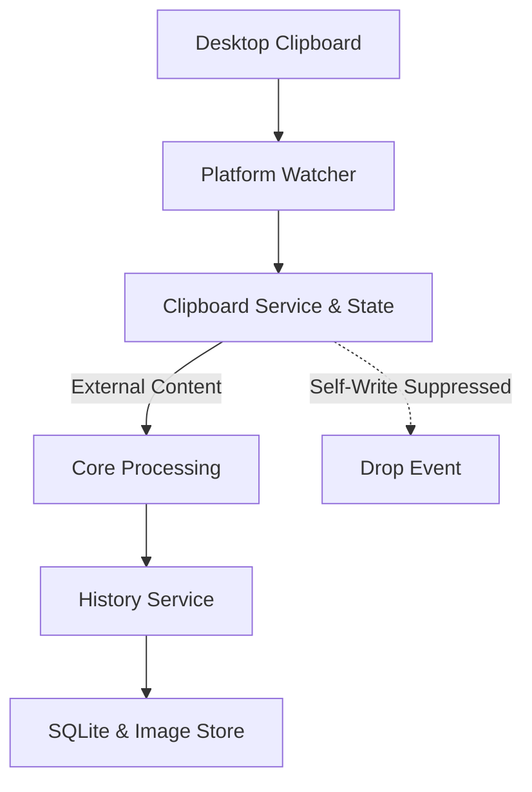

# Clipboard Subsystem

This document describes the clipboard subsystem of Pookie Paste: how clipboard content is detected and captured, how X11 and Wayland differ, how MIME types are negotiated, how normalization and canonicalization work, how self-writes are suppressed, and how items transition into persistent storage.

---

## Responsibilities

Clipboard handling is divided across distinct layers to maintain clear boundaries between one-shot I/O, continuous monitoring, policy filtering, and persistence:

* **`ClipboardBackend`**: Trait providing one-shot read and write access to the current system clipboard (`read_content`, `write_content`).
* **`ClipboardWatcher`**: Trait providing a continuous event channel (`Receiver<ClipboardEvent>`) that emits new clipboard contents as they occur.
* **`ClipboardService`**: Daemon-level orchestrator that executes writes through the active backend and immediately registers self-write suppression markers.
* **`ClipboardState`**: Lightweight, thread-safe store holding the fingerprint of Pookie's last write to recognize and discard self-generated watcher events.
* **`ClipboardProcessor`**: Core processing pipeline that normalizes input, checks size and empty-content policy, hashes content with SHA-256, and constructs typed `ClipboardItem` values.
* **`ClipboardHistoryService`**: Coordinates SQLite indexing, deduplication, item promotion, eviction enforcement, and filesystem image storage.
* **`StorageRepository` & `ImageStore`**: Persistence layer managing the SQLite database file and the canonical image files directory.

---

## End-to-End Capture Flow

The following diagram illustrates how an external clipboard copy flows from the desktop session into persistent storage:



1. **Detection**: The platform-specific watcher detects a clipboard modification on the desktop session (via X11 polling or Wayland data-control selection offers).
2. **Filtering**: The daemon receives the event and checks `ClipboardState`. If the content matches Pookie's most recent writeback, the event is dropped.
3. **Processing**: External content passes through `ClipboardProcessor` for newline normalization, whitespace trimming (text), policy limits checking, and SHA-256 hashing.
4. **Coordination**: `ClipboardHistoryService` checks for duplicates by hash and content kind. If duplicate, it promotes the existing item; if new, it commits text to SQLite or image bytes to `ImageStore`.
5. **Eviction**: If total items exceed the configured limit, the oldest unpinned items are evicted from SQLite and disk.

---

## Backend vs. Watcher

Pookie Paste deliberately decouples one-shot clipboard access from continuous monitoring:

1. **One-Shot Read/Write (`ClipboardBackend`)**:
   Used during user-directed actions, such as writing content back to the system clipboard upon history item activation, or executing manual clipboard reads.
2. **Continuous Monitoring (`ClipboardWatcher`)**:
   A long-running background task that monitors desktop selection offers and emits events whenever another application updates the clipboard.

On X11, read/write and monitoring share the same underlying X display connection, but Wayland fundamentally separates them: read/write uses standard Wayland data-device protocols (via `wl-clipboard-rs`), whereas continuous background monitoring requires privileged data-control protocols (`ext-data-control-v1` or `zwlr_data_control_v1`).

---

## Platform Behavior

### X11

* **Read/Write Backend** ([`crates/pookie-clipboard/src/x11.rs`](../../crates/pookie-clipboard/src/x11.rs)):
  Uses `arboard::Clipboard` wrapped in a mutex. When reading, it queries for an available image first via `get_image()`. If present, it extracts raw RGBA pixels and converts them to canonical PNG bytes. Otherwise, it falls back to `get_text()`. On writeback, text is written via `set_text()`, while canonical PNG images are decoded into raw RGBA8 pixels and transferred via `ImageData`.
* **Watcher** ([`crates/pookie-clipboard/src/x11_watcher.rs`](../../crates/pookie-clipboard/src/x11_watcher.rs)):
  Runs a periodic polling loop (`POLL_INTERVAL = 500ms`) using `tokio::time::interval`. On each tick, it calls `clipboard.read_content()`, skips empty payloads, and compares the result against the previously emitted `ClipboardContent`. A new `ClipboardEvent` is emitted only when content has changed.

### Wayland

* **Read/Write Backend** ([`crates/pookie-clipboard/src/wayland/clipboard_backend.rs`](../../crates/pookie-clipboard/src/wayland/clipboard_backend.rs)):
  Uses `wl-clipboard-rs` for one-shot operations. When reading, it queries advertised MIME types with `get_mime_types_ordered()` and prioritizes supported image formats over text. On writeback, text is served as `text/plain`, while images are served as `image/png` using canonical PNG bytes directly.
* **Watcher** ([`crates/pookie-clipboard/src/wayland/watcher.rs`](../../crates/pookie-clipboard/src/wayland/watcher.rs)):
  Queries the compositor registry during startup and binds to one of two data-control protocols:
  1. `ext_data_control_manager_v1` (preferred modern standard).
  2. `zwlr_data_control_manager_v1` (fallback protocol supported by wlroots-based compositors).

  Compositor capabilities vary across Wayland environments: background clipboard monitoring succeeds only if the compositor advertises one of these supported data-control protocols. If neither protocol is advertised, the background watcher cannot run.
* **Offer Lifecycle & Stream Reading** ([`crates/pookie-clipboard/src/wayland/ext_data_control.rs`](../../crates/pookie-clipboard/src/wayland/ext_data_control.rs), [`crates/pookie-clipboard/src/wayland/wlr_data_control.rs`](../../crates/pookie-clipboard/src/wayland/wlr_data_control.rs)):
  For each new selection offer, the watcher resets its internal offer state, clearing previously collected MIME types and handles so types from an earlier copy (such as an `image/png` offer) do not survive into a subsequent selection.
* **Transfer Safety Ceiling** ([`crates/pookie-clipboard/src/wayland/clipboard_reader.rs`](../../crates/pookie-clipboard/src/wayland/clipboard_reader.rs)):
  Data transfer creates a Unix pipe, requests the selected MIME format via the selection offer handle, and streams bytes on a dedicated worker thread. A transfer safety ceiling of **64 MiB** (`MAX_CLIPBOARD_TRANSFER_BYTES`) prevents an untrusted clipboard source from causing unbounded memory allocation during transfer.

---

## MIME Selection

Applications frequently advertise multiple representations for a single copy operation (for example, web browsers copying an image often offer `image/png`, `image/jpeg`, and a fallback `text/plain` URL).

Pookie Paste enforces an explicit rule: **Image representations strictly supersede text representations.**

```text
Application offers:
  ├── image/png
  ├── image/jpeg
  └── text/plain

Pookie selects:
  └── image/png (captured as image; text fallback ignored)
```

### Supported Formats & Precedence

Supported image formats are prioritized over text, ordered by:
1. **PNG** (`image/png`, `image/x-png`)
2. **JPEG** (`image/jpeg`, `image/jpg`, `image/pjpeg`)
3. **WebP** (`image/webp`)
4. **BMP** (`image/bmp`, `image/x-bmp`, `image/x-ms-bmp`)
5. **GIF** (`image/gif`)

### Selection & Fallback Behavior

MIME candidate evaluation in [`crates/pookie-clipboard/src/wayland/mime.rs`](../../crates/pookie-clipboard/src/wayland/mime.rs) follows strict rules:

* **Image Offers**: If an application offers any supported image format, Pookie selects only the single highest-priority image MIME type. Text fallback representations are completely omitted from the candidate list. If reading or decoding this image yields an empty payload or fails, Pookie does not fall back to text.
* **Text-Only Offers**: If no supported image MIME type is present, Pookie builds an ordered list of advertised text formats:
  1. `text/plain;charset=utf-8`
  2. `text/plain;charset=UTF-8`
  3. `text/plain`
  If the highest-priority text candidate yields an empty payload, the reader advances to the next text candidate in the list before aborting.

---

## Content Processing

The core processing pipeline ([`crates/pookie-core/src/processor.rs`](../../crates/pookie-core/src/processor.rs)) converts raw clipboard events into normalized, validated, and hashed items.

### Text Processing

* **Normalization** ([`ContentNormalizer`](../../crates/pookie-core/src/normalizer.rs)): Converts Windows CRLF (`\r\n`) and legacy Mac CR (`\r`) line endings to standard Unix newlines (`\n`), and removes leading and trailing whitespace with `.trim()`.
* **Policy Limits** ([`ClipboardPolicy`](../../crates/pookie-core/src/policy.rs)): Rejects empty strings. Enforces a maximum text size limit of **1 MiB** (`MAX_TEXT_SIZE = 1024 * 1024` bytes).
* **Identity & Hashing** ([`ContentHasher`](../../crates/pookie-core/src/hasher.rs)): Hashes normalized UTF-8 text bytes using SHA-256 to establish stable content identity.

### Image Processing & Canonicalization

Every accepted clipboard image is decoded and converted to a single canonical format: **PNG-encoded RGBA8 bytes**.

* **Decoding Limits & Safety** ([`crates/pookie-clipboard/src/image_codec.rs`](../../crates/pookie-clipboard/src/image_codec.rs)):
  Before decoding untrusted image data, strict safety guards are enforced:
  * Maximum image dimensions: **16,384 × 16,384 px** (`MAX_IMAGE_DIMENSION`).
  * Maximum decoded pixel count: **40,000,000 pixels** (`MAX_IMAGE_PIXELS`, ~8K resolution ceiling).
  * Decoder memory allocation limit: **256 MiB** (`MAX_DECODE_ALLOCATION`).
* **Policy Limit**: Maximum compressed payload size of **10 MiB** (`MAX_IMAGE_SIZE = 10 * 1024 * 1024` bytes).
* **Architectural Rationale for Canonicalization**:
  1. **Consistent Internal Representation**: Canonicalization provides Pookie with one consistent internal format (PNG-encoded RGBA8 bytes) for the decoded pixel content it received. This simplifies content hashing, deduplication comparisons, disk persistence, and UI preview rendering. (Note: Because lossy encodings such as JPEG or lossy WebP decode to slightly different pixel values, visually equivalent images copied from different lossy sources are not guaranteed to yield identical hashes).
  2. **Predictable Persistence**: The filesystem store only manages a single format (`.png`).
  3. **Simplified Preview Generation**: The UI thumbnail cache only requires a single decoder path.
  4. **Discards Non-Pixel Container Data**: Re-encoding through `image::codecs::png::PngEncoder` discards source-format container structures and metadata not part of the decoded RGBA8 pixel representation, ensuring a uniform stored representation.

---

## Self-Write Suppression

When a user selects an item from Pookie Paste, the application writes that item back to the system clipboard so the target application can paste it. This triggers a clipboard change notification from the platform watcher.

Without suppression, Pookie would mistake its own clipboard write for an external user copy, creating duplicate history entries and redundant feedback processing.

### Core Invariant

> **Pookie-originated clipboard writes must never re-enter history.**

### Suppression Mechanism ([`crates/daemon/src/clipboard_state.rs`](../../crates/daemon/src/clipboard_state.rs))

1. **Fingerprint Recording**:
   When [`ClipboardService::write()`](../../crates/daemon/src/clipboard_service.rs) successfully updates the clipboard, it generates a `ClipboardFingerprint`:
   ```rust
   struct ClipboardFingerprint {
       kind: ClipboardContentKind, // Text or Image
       hash: String,               // SHA-256 hex digest
   }
   ```
   `ClipboardState` retains only this compact content fingerprint (content kind and SHA-256 hash) for suppression and does not retain the full clipboard payload.
2. **Single-Use Consumption**:
   When the watcher emits an event, the daemon event loop checks `clipboard_state.is_self_write(&event.content)`. If the hash and content kind match, the fingerprint is cleared, and the event is dropped.
3. **Non-Matching Events**:
   If an unrelated clipboard event arrives while a marker is pending, `is_self_write` returns `false` and leaves the marker intact.
4. **Write-Failure Safety**:
   If `backend.write_content()` fails, `mark_written` is skipped, ensuring no dangling suppression markers remain.

---

## History & Storage Boundary

Once content passes the processing pipeline, it is committed to storage by [`ClipboardHistoryService`](../../crates/history/src/service.rs):

* **Text Entries**: Stored directly in the SQLite `clipboard_items` table with no external file references.
* **Image Entries**: Written to `$XDG_DATA_HOME/pookie-paste/images/<uuid>.png` via [`ImageStore`](../../crates/storage/src/image_store.rs). SQLite stores the metadata and an application-relative reference (`images/<uuid>.png`).
* **Atomic File Writes**: `ImageStore` writes new images to a temporary sibling file and renames it into place. If the database insertion fails, the newly created image file is unlinked immediately.
* **Deduplication & Promotion**:
  If an incoming item matches an existing item's hash and content type:
  * For text: The existing row is removed and re-inserted with the new timestamp, preserving its pinned status (`pinned_at`).
  * For images: If the referenced image file exists on disk, SQLite updates the timestamp without rewriting the image file.
* **Eviction**:
  When total item count exceeds the configured limit (`max_items`, default 100), eviction selects the oldest unpinned items, deleting SQLite rows first and unlinking corresponding disk images. Pinned items are strictly excluded from eviction.
* **Startup Reconciliation**:
  During daemon startup, the image directory is reconciled against active SQLite records, unlinking orphaned image files and leftover temporary files.

---

## Core Invariants

| Invariant | Guarantee |
| --- | --- |
| **Self-Write Suppression** | Pookie-originated clipboard writes must never re-enter history. |
| **Image Priority** | Supported image representations always supersede text fallback representations in clipboard offers. |
| **Canonical Image Representation** | All clipboard images are canonical PNG-encoded RGBA8 bytes throughout processing and storage. |
| **Atomic Image Writes** | Image file creation uses atomic temporary files with automatic rollback on database failure. |
| **Pinned Item Protection** | Items marked as pinned (`pinned_at IS NOT NULL`) are strictly protected from capacity eviction. |

---

## Implementation References

| Component | Responsibility | Repository File Path |
| --- | --- | --- |
| **Core Processor** | Normalization, policy limits, hashing, and item creation | [`crates/pookie-core/src/processor.rs`](../../crates/pookie-core/src/processor.rs) |
| **Normalizer** | Line ending normalization (CRLF/CR to LF) and text trimming | [`crates/pookie-core/src/normalizer.rs`](../../crates/pookie-core/src/normalizer.rs) |
| **Policy** | Size and empty-content validation | [`crates/pookie-core/src/policy.rs`](../../crates/pookie-core/src/policy.rs) |
| **Hasher** | SHA-256 content hashing | [`crates/pookie-core/src/hasher.rs`](../../crates/pookie-core/src/hasher.rs) |
| **Image Codec** | Canonical PNG encoding, format decoding, and safety checks | [`crates/pookie-clipboard/src/image_codec.rs`](../../crates/pookie-clipboard/src/image_codec.rs) |
| **X11 Clipboard & Watcher** | X11 `arboard` read/write backend and polling watcher | [`crates/pookie-clipboard/src/x11.rs`](../../crates/pookie-clipboard/src/x11.rs), [`crates/pookie-clipboard/src/x11_watcher.rs`](../../crates/pookie-clipboard/src/x11_watcher.rs) |
| **Wayland Backend** | `wl-clipboard-rs` read/write implementation | [`crates/pookie-clipboard/src/wayland/clipboard_backend.rs`](../../crates/pookie-clipboard/src/wayland/clipboard_backend.rs) |
| **Wayland Watcher** | `ext`/`wlr` data-control protocol watcher | [`crates/pookie-clipboard/src/wayland/watcher.rs`](../../crates/pookie-clipboard/src/wayland/watcher.rs) |
| **Wayland Data Control** | Offer tracking, pipe streaming, and candidate iteration | [`crates/pookie-clipboard/src/wayland/ext_data_control.rs`](../../crates/pookie-clipboard/src/wayland/ext_data_control.rs), [`crates/pookie-clipboard/src/wayland/wlr_data_control.rs`](../../crates/pookie-clipboard/src/wayland/wlr_data_control.rs) |
| **MIME Negotiation** | Content and text MIME preference evaluation | [`crates/pookie-clipboard/src/wayland/mime.rs`](../../crates/pookie-clipboard/src/wayland/mime.rs) |
| **Clipboard Service** | Writeback orchestration and self-write registration | [`crates/daemon/src/clipboard_service.rs`](../../crates/daemon/src/clipboard_service.rs) |
| **Clipboard State** | Compact self-write fingerprint tracking | [`crates/daemon/src/clipboard_state.rs`](../../crates/daemon/src/clipboard_state.rs) |
| **History Service** | Deduplication, promotion, eviction, and store coordination | [`crates/history/src/service.rs`](../../crates/history/src/service.rs) |
| **Storage Repository** | SQLite queries, indexing, and unpinned eviction | [`crates/storage/src/repository.rs`](../../crates/storage/src/repository.rs) |
| **Image Store** | Filesystem storage, atomic temporary files, and cleanup | [`crates/storage/src/image_store.rs`](../../crates/storage/src/image_store.rs) |
