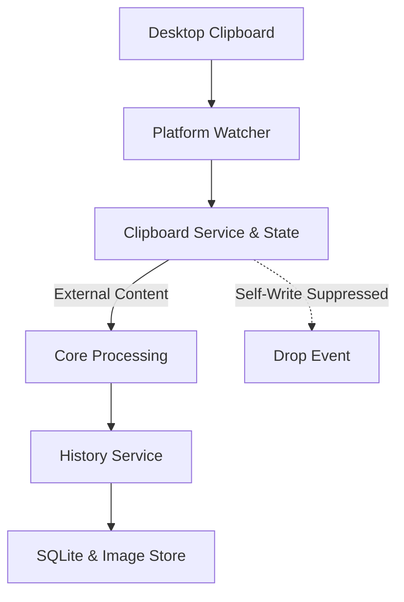

# Clipboard Subsystem

This document describes the clipboard subsystem of Pookie Paste: how clipboard content is detected and captured, how X11 and Wayland differ, how MIME types are negotiated, how normalization and canonicalization work, how self-writes are suppressed, and how items transition into persistent storage.

---

## Responsibilities

Clipboard handling is divided across distinct layers to maintain clear boundaries between one-shot I/O, continuous monitoring, policy filtering, and persistence:

* **`ClipboardBackend`**: Trait providing one-shot read and write access to the current system clipboard (`read_content`, `write_content`).
* **`ClipboardWatcher`**: Trait providing a continuous event channel (`Receiver<ClipboardEvent>`) that emits new clipboard contents as they occur via platform-native event-driven monitoring (XFixes on X11, data-control protocols on Wayland).
* **`ClipboardService`**: Daemon-level orchestrator that executes writes through the active backend and immediately registers self-write suppression markers.
* **`ClipboardState`**: Lightweight, thread-safe store holding the compact fingerprint of Pookie's last write to recognize and discard self-generated watcher events.
* **`ClipboardProcessor`**: Core processing pipeline that normalizes input, checks size and empty-content policy, computes stable content identity (SHA-256 for text, `rgba-v1` pixel identity for images), and constructs typed `ClipboardItem` values.
* **`ClipboardHistoryService`**: Coordinates SQLite indexing, in-place deduplication, item promotion, missing-file recovery, eviction enforcement, and filesystem image storage.
* **`StorageRepository` & `ImageStore`**: Persistence layer managing the SQLite database file and the canonical image files directory.

---

## End-to-End Capture Flow

The following diagram illustrates how an external clipboard copy flows from the desktop session into persistent storage:



1. **Detection**: The platform-specific watcher detects a clipboard modification on the desktop session (via X11 XFixes selection notifications or Wayland data-control selection offers).
2. **Filtering**: The daemon receives the event and checks `ClipboardState`. If the content matches Pookie's most recent writeback, the event is dropped.
3. **Processing**: External content passes through `ClipboardProcessor` for newline normalization, whitespace trimming (text), bounded decoding and canonicalization (images), policy limits checking, and content identity calculation (SHA-256 for text, `rgba-v1` pixel identity for images).
4. **Coordination**: `ClipboardHistoryService` checks for duplicates by content identity and kind. If duplicate, it promotes the existing item in place (updating its timestamp while preserving row ID and pin status, re-saving missing backing files if needed); if new, it commits text to SQLite or image bytes to `ImageStore`.
5. **Eviction**: If total items exceed the configured limit, the oldest unpinned items are evicted from SQLite and disk.

---

## Backend vs. Watcher

Pookie Paste deliberately decouples one-shot clipboard access from continuous monitoring:

1. **One-Shot Read/Write (`ClipboardBackend`)**:
   Used during user-directed actions, such as writing content back to the system clipboard upon history item activation, or executing manual clipboard reads.
2. **Continuous Monitoring (`ClipboardWatcher`)**:
   A long-running background task that monitors desktop selection offers and emits events whenever another application updates the clipboard.

On X11, read/write and monitoring share the same underlying X display connection, but Wayland fundamentally separates them: read/write uses standard Wayland data-device protocols (via `wl-clipboard-rs`), whereas continuous background monitoring requires privileged data-control protocols (`ext-data-control-v1` or `zwlr_data_control_v1`).

---

## Platform Behavior

### X11

* **Read/Write Backend** ([`crates/pookie-clipboard/src/x11.rs`](../../crates/pookie-clipboard/src/x11.rs)):
  Uses `arboard::Clipboard` wrapped in a mutex. When reading, it evaluates MIME precedence: querying for available image content first via `get_image()`, extracting raw RGBA pixels into a `CanonicalImage`. If file-manager URI data (`text/uri-list`) is offered, it attempts to resolve a single local image file. Otherwise, it falls back to `get_text()`. On writeback, text is written via `set_text()`, while canonical PNG images are decoded into raw RGBA8 pixels and transferred via `ImageData`.
* **Watcher** ([`crates/pookie-clipboard/src/x11_watcher.rs`](../../crates/pookie-clipboard/src/x11_watcher.rs)):
  Operates primarily event-driven using the XFixes extension (`SelectionNotify` events). When the X11 selection owner changes, the watcher receives an event and initiates a clipboard read. Where event delivery is unsupported or incomplete, it falls back to lightweight polling of the selection owner window XID and `TIMESTAMP` property, performing a full clipboard read only when the selection generation actually changes.

  Important X11 watcher characteristics:
  * **Generation-based reads**: Full clipboard data transfers occur only when the selection generation changes. The watcher recognizes that identical owner XIDs do not imply the same clipboard generation.
  * **Capability caching**: Advertised `TARGETS` capability state is invalidated whenever the selection generation changes.
  * **No watcher-level suppression**: The watcher does not suppress events matching previous content. Repeated identical copies pass through to `ClipboardHistoryService`, where deduplication and in-place promotion handle them cleanly.

### Wayland

* **Read/Write Backend** ([`crates/pookie-clipboard/src/wayland/clipboard_backend.rs`](../../crates/pookie-clipboard/src/wayland/clipboard_backend.rs)):
  Uses `wl-clipboard-rs` for one-shot operations. When reading, it queries advertised MIME types with `get_mime_types_ordered()` and prioritizes supported image formats over text. On writeback, text is served as `text/plain`, while images are served as `image/png` using canonical PNG bytes directly.
* **Watcher** ([`crates/pookie-clipboard/src/wayland/watcher.rs`](../../crates/pookie-clipboard/src/wayland/watcher.rs)):
  Queries the compositor registry during startup and binds to one of two data-control protocols:
  1. `ext_data_control_manager_v1` (preferred modern standard).
  2. `zwlr_data_control_manager_v1` (fallback protocol supported by wlroots-based compositors).

  Compositor capabilities vary across Wayland environments: background clipboard monitoring succeeds only if the compositor advertises one of these supported data-control protocols. If neither protocol is advertised, the background watcher cannot run.
* **Offer Lifecycle & Stream Reading** ([`crates/pookie-clipboard/src/wayland/ext_data_control.rs`](../../crates/pookie-clipboard/src/wayland/ext_data_control.rs), [`crates/pookie-clipboard/src/wayland/wlr_data_control.rs`](../../crates/pookie-clipboard/src/wayland/wlr_data_control.rs)):
  For each new selection offer, the watcher resets its internal offer state, clearing previously collected MIME types and handles so types from an earlier copy (such as an `image/png` offer) do not survive into a subsequent selection.
* **Transfer Safety Ceiling** ([`crates/pookie-clipboard/src/wayland/clipboard_reader.rs`](../../crates/pookie-clipboard/src/wayland/clipboard_reader.rs)):
  Data transfer creates a Unix pipe, requests the selected MIME format via the selection offer handle, and streams bytes on a dedicated worker thread. A transfer safety ceiling of **64 MiB** (`MAX_CLIPBOARD_TRANSFER_BYTES`) prevents an untrusted clipboard source from causing unbounded memory allocation during transfer.

---

## MIME Selection

Applications frequently advertise multiple representations for a single copy operation (for example, web browsers copying an image often offer `image/png`, `image/jpeg`, and a fallback `text/plain` URL; file managers offer `text/uri-list` alongside fallback path strings).

Pookie Paste enforces an explicit 3-tier precedence hierarchy across all platforms:

1. **Direct Supported Image Representation**
2. **File-Manager URI List (`text/uri-list`)**
3. **Genuine Text**

```text
Application offers:
  ├── image/png (or image/jpeg, etc.)
  ├── text/uri-list
  └── text/plain

Pookie selects:
  └── image/png (direct image strictly supersedes uri-list and text)
```

### Supported Image Formats & Precedence

When evaluating direct image representations, supported formats are prioritized in order:
1. **PNG** (`image/png`, `image/x-png`)
2. **JPEG** (`image/jpeg`, `image/jpg`, `image/pjpeg`)
3. **WebP** (`image/webp`)
4. **BMP** (`image/bmp`, `image/x-bmp`, `image/x-ms-bmp`)
5. **GIF** (`image/gif`)

### File-Manager Image Capture (`text/uri-list`)

Pookie Paste supports clipboard history strictly for `Text` and `Image`. There is no generic `File` history type.

When files are copied in desktop file managers, the selection includes `text/uri-list`. Pookie handles this format under strict invariants:

* **Authoritative File-Copy Context**: If `text/uri-list` is offered, it is treated as authoritative file-copy context rather than arbitrary text.
* **Single Image Resolution**: If the URI list resolves to **exactly one** valid, local supported image file, Pookie decodes and captures it as a first-class `Image`.
* **Rejection Without Fallback**: If the URI list contains a directory, a non-image file (such as a PDF or text document), multiple files, a remote URI (e.g. `http://` or `smb://`), or a malformed URI list, the capture is ignored entirely. Crucially, failure to resolve an image from `text/uri-list` **does not fall back to `text/plain`**. This prevents file-manager fallback path strings from polluting history as text.
* **Literal Paths from Text Sources**: A literal filesystem path copied as plain text from an editor or terminal (where `text/uri-list` is not offered) remains normal `Text`.

### Text Selection & Fallback Behavior

MIME candidate evaluation in [`crates/pookie-clipboard/src/wayland/mime.rs`](../../crates/pookie-clipboard/src/wayland/mime.rs) follows strict rules:

* **Image Offers**: If an application offers any supported direct image format, Pookie selects only the single highest-priority image MIME type. All fallback representations (`text/uri-list`, `text/plain`) are completely omitted. If reading or decoding this image yields an empty payload or fails, Pookie does not fall back to text.
* **URI-List Offers**: If no direct image format is present but `text/uri-list` is offered, Pookie evaluates the URI list as described above. No fallback to `text/plain` is permitted.
* **Text-Only Offers**: If neither direct image formats nor `text/uri-list` are present, Pookie builds an ordered candidate list of advertised text formats:
  1. `text/plain;charset=utf-8`
  2. `text/plain;charset=UTF-8`
  3. `text/plain`
  If the highest-priority text candidate yields an empty payload, the reader advances to the next text candidate in the list before aborting.

---

## Content Processing

The core processing pipeline ([`crates/pookie-core/src/processor.rs`](../../crates/pookie-core/src/processor.rs)) converts raw clipboard events into normalized, validated, and hashed items.

### Text Processing

* **Normalization** ([`ContentNormalizer`](../../crates/pookie-core/src/normalizer.rs)): Converts Windows CRLF (`\r\n`) and legacy Mac CR (`\r`) line endings to standard Unix newlines (`\n`), and removes leading and trailing whitespace with `.trim()`.
* **Policy Limits** ([`ClipboardPolicy`](../../crates/pookie-core/src/policy.rs)): Rejects empty strings. Enforces a maximum text size limit of **1 MiB** (`MAX_TEXT_SIZE = 1024 * 1024` bytes).
* **Identity & Hashing** ([`ContentHasher`](../../crates/pookie-core/src/hasher.rs)): Hashes normalized UTF-8 text bytes using SHA-256 to establish stable content identity.

### Image Processing & Canonicalization

Every accepted clipboard image is decoded, verified, hashed, and converted into a typed `CanonicalImage` containing:
* **Canonical PNG bytes**: persisted to disk and used for desktop clipboard writeback.
* **`ImageIdentity`**: domain-separated hash of decoded pixels used for deduplication and indexing.

#### Capture & Canonicalization Pipeline

Input images flow through a bounded pipeline ([`crates/pookie-clipboard/src/image_codec.rs`](../../crates/pookie-clipboard/src/image_codec.rs)):

```text
input image
  → bounded safe decode / obtain RGBA
  → validate dimensions and allocation
  → compute rgba-v1 identity ──┐ (concurrently from immutable RGBA8 buffer)
  → encode canonical PNG     ──┘ (Fast compression + Adaptive filtering)
  → CanonicalImage
```

1. **Safe Bounded Decode**: The input bytes or raw pixel buffers are decoded into standard RGBA8 pixels under strict bounds. Where ownership allows, `into_rgba8()` is used to avoid unnecessary buffer copies.
2. **Dimension & Allocation Validation**: Strict safety guards protect against decompression bombs:
   * Maximum image dimensions: **16,384 × 16,384 px** (`MAX_IMAGE_DIMENSION`).
   * Maximum decoded pixel count: **40,000,000 pixels** (`MAX_IMAGE_PIXELS`, ~8K resolution ceiling).
   * Decoder memory allocation limit: **256 MiB** (`MAX_DECODE_ALLOCATION`).
3. **Concurrent Hashing and PNG Encoding**: Hashing and canonical PNG encoding execute concurrently from the same immutable RGBA8 buffer across worker threads. Canonical PNG encoding uses Fast compression and Adaptive filtering for low latency.
4. **Canonical PNG Emergency Ceiling**: An emergency output ceiling of **32 MiB** (`MAX_IMAGE_SIZE = 32 * 1024 * 1024` bytes) is enforced on the resulting canonical PNG payload.

> [!IMPORTANT]
> The 32 MiB limit is an emergency ceiling for the resulting canonical PNG payload, **not** a source-file size limit. Untrusted source images are bounded by decoder memory allocation (256 MiB) and pixel limits (40M px).

#### Stable Image Identity (`rgba-v1`)

Image identity and deduplication are derived directly from straight decoded RGBA8 pixels, **not** from canonical PNG bytes, container headers, or compression artifacts:

```text
rgba-v1:<64 lowercase hex>
```

The identity string is computed as:

```text
SHA256(
  b"pookie-image-rgba-v1\0"
  || width.to_be_bytes()
  || height.to_be_bytes()
  || straight RGBA8 row-major pixels
)
```

This domain-separated pixel identity guarantees:
1. **Format Independence**: Visually identical pixels yield the exact same identity regardless of whether the source was PNG, BMP, or lossless WebP.
2. **Encoder Invariance**: Future changes to PNG compression libraries or filter parameters cannot alter image hashes or break historical deduplication.
3. **Clear Boundary**: Canonical PNG remains the persisted file representation on disk, while `rgba-v1` is strictly the identity and deduplication representation in SQLite.

---

## Self-Write Suppression

When a user selects an item from Pookie Paste, the application writes that item back to the system clipboard so the target application can paste it. This triggers a clipboard change notification from the platform watcher.

Without suppression, Pookie would mistake its own clipboard write for an external user copy, creating duplicate history entries and redundant feedback processing.

### Core Invariant

> **Pookie-originated clipboard writes must never re-enter history.**

### Suppression Mechanism ([`crates/daemon/src/clipboard_state.rs`](../../crates/daemon/src/clipboard_state.rs))

1. **Fingerprint Recording**:
   When [`ClipboardService::write()`](../../crates/daemon/src/clipboard_service.rs) successfully updates the clipboard, it generates a `ClipboardFingerprint`:
   ```rust
   struct ClipboardFingerprint {
       kind: ClipboardContentKind, // Text or Image
       identity: String,           // SHA-256 for text, rgba-v1:<hex> for images
   }
   ```
   `ClipboardState` retains only this compact content fingerprint (content kind and identity string) for suppression and does not retain the full clipboard payload.
2. **Single-Use Consumption**:
   When the watcher emits an event, the daemon event loop checks `clipboard_state.is_self_write(&event.content)`. If the hash and content kind match, the fingerprint is cleared, and the event is dropped.
3. **Non-Matching Events**:
   If an unrelated clipboard event arrives while a marker is pending, `is_self_write` returns `false` and leaves the marker intact.
4. **Write-Failure Safety**:
   If `backend.write_content()` fails, `mark_written` is skipped, ensuring no dangling suppression markers remain.

---

## History & Storage Boundary

Once content passes the processing pipeline, it is committed to storage by [`ClipboardHistoryService`](../../crates/history/src/service.rs):

* **Authority & Dual-Layer Storage**: SQLite owns item metadata, text content, content identity strings, timestamps, pinning status, and application-relative image paths (`images/<uuid>.png`). SQLite is authoritative. `ImageStore` owns standalone canonical PNG files. Image file cleanup on disk occurs best-effort after authoritative SQLite mutations commit.
* **Text Entries**: Stored directly in the SQLite `clipboard_items` table with no external file references.
* **Image Entries**: Written to `$XDG_DATA_HOME/pookie-paste/images/<uuid>.png` via [`ImageStore`](../../crates/storage/src/image_store.rs). SQLite stores the metadata, `rgba-v1` identity, and an application-relative reference (`images/<uuid>.png`).
* **Atomic File Writes**: `ImageStore` writes new images to a temporary sibling file and renames it atomically into place. If the database insertion fails, the newly created image file is unlinked immediately.
* **Deduplication & In-Place Promotion**:
  When an incoming item matches an existing item's content identity and kind:
  * **For Text**: The existing row is promoted **in place** by updating `created_at` to the current time, maintaining its stable database row ID and preserving its `pinned_at` state.
  * **For Images**: If the existing row's backing file still exists in `ImageStore`, SQLite updates `created_at` in place (preserving the row ID and pin state) without rewriting the image file. If the backing file is missing from disk, the stale row is replaced using the fresh canonical image while preserving pin state.
* **Capacity Eviction**:
  When total item count exceeds the configured limit (`max_items`, default 100), eviction selects the oldest unpinned items, deleting SQLite rows first and unlinking corresponding disk images. Pinned items are strictly excluded from eviction.
* **Startup Reconciliation**:
  During daemon startup, `ImageStore` reconciles the image directory against authoritative SQLite records: every file referenced by an active image row is strictly preserved, while unreferenced PNG files and stale temporary files are unlinked.

### Legacy Image Identity Migration

Daemon startup supports legacy image rows created prior to `rgba-v1` pixel identities (where image rows recorded raw 64-hex SHA-256 digests of canonical PNG bytes):

* **Background Execution**: Migration runs as a background task following daemon startup, adding zero synchronous decoding work to the startup critical path.
* **Sequential & Idempotent**: Legacy candidate rows (content type `Image` with exactly 64 lowercase hex characters and no version prefix) are processed sequentially (`concurrency = 1`).
* **No Image Re-Encoding**: Migration decodes the existing stored PNG file, computes its `rgba-v1` pixel identity, and updates the database row. The image file on disk is not rewritten or re-encoded.
* **Collision Consolidation**: If multiple legacy rows resolve to the same `rgba-v1` pixel identity, they are atomically consolidated into a single survivor row inside a database transaction, preserving the most favorable pin and recency timestamps. Redundant image files are cleaned up best-effort post-commit.
* **Race-Safe Mutation Gate**: A targeted image mutation gate (`image_mutation_gate`) synchronizes runtime image saves and deduplication with migration, preventing conflicting insertions.
* **Error Resilience**: Missing or corrupt image files log a warning and remain unchanged without aborting the migration.

---

## Core Invariants

| Invariant | Guarantee |
| --- | --- |
| **Self-Write Suppression** | Pookie-originated clipboard writes must never re-enter history. |
| **MIME Precedence** | Direct images strictly supersede `text/uri-list`, which strictly supersedes text fallbacks. |
| **Authoritative File Copy** | `text/uri-list` resolves exclusively to single local images; non-images and multi-files are ignored without text fallback. |
| **Stable Image Identity** | Image deduplication is governed by decoded RGBA8 pixel identity (`rgba-v1:<hex>`), completely decoupled from PNG compression bytes. |
| **Canonical Image Representation** | All clipboard images are canonical PNG-encoded RGBA8 bytes throughout processing and disk storage. |
| **In-Place Duplicate Promotion** | Duplicate items preserve stable row IDs and pin state while updating timestamps; missing image files are restored automatically. |
| **Atomic Image Writes & Authority** | SQLite is authoritative; disk image creation uses atomic sibling files with rollback on database failure. |
| **Startup Reconciliation** | Unreferenced and stale temporary image files are cleaned up at startup while preserving all DB-referenced images. |
| **Pinned Item Protection** | Items marked as pinned (`pinned_at IS NOT NULL`) are strictly protected from capacity eviction. |

---

## Related Documentation

* [**Architecture Overview**](../architecture/overview.md): High-level system structure, architectural boundaries, and crate organization.
* [**Runtime Model**](../architecture/runtime-model.md): Multi-process lifecycle, memory usage, and background threads.
* [**Activation Overview**](../activation/overview.md): Focus restoration, target confirmation, and synthetic paste.
* [**IPC Overview**](../ipc/overview.md): Unix domain socket protocol, request routing, and history serialization.

---

## Implementation References

| Component | Responsibility | Repository File Path |
| --- | --- | --- |
| **Core Processor** | Normalization, policy limits, identity computation, and item creation | [`crates/pookie-core/src/processor.rs`](../../crates/pookie-core/src/processor.rs) |
| **Normalizer** | Line ending normalization (CRLF/CR to LF) and text trimming | [`crates/pookie-core/src/normalizer.rs`](../../crates/pookie-core/src/normalizer.rs) |
| **Policy** | Size and empty-content validation | [`crates/pookie-core/src/policy.rs`](../../crates/pookie-core/src/policy.rs) |
| **Hasher** | Content identity hashing (SHA-256 for text, `rgba-v1` pixel identity for images) | [`crates/pookie-core/src/hasher.rs`](../../crates/pookie-core/src/hasher.rs) |
| **Image Codec** | Canonical PNG encoding (Fast + Adaptive), format decoding, `rgba-v1` identity, and safety bounds | [`crates/pookie-clipboard/src/image_codec.rs`](../../crates/pookie-clipboard/src/image_codec.rs) |
| **X11 Clipboard & Watcher** | X11 `arboard` backend and XFixes event-driven watcher with generation fallback polling | [`crates/pookie-clipboard/src/x11.rs`](../../crates/pookie-clipboard/src/x11.rs), [`crates/pookie-clipboard/src/x11_watcher.rs`](../../crates/pookie-clipboard/src/x11_watcher.rs) |
| **Wayland Backend** | `wl-clipboard-rs` read/write implementation | [`crates/pookie-clipboard/src/wayland/clipboard_backend.rs`](../../crates/pookie-clipboard/src/wayland/clipboard_backend.rs) |
| **Wayland Watcher** | `ext`/`wlr` data-control protocol watcher | [`crates/pookie-clipboard/src/wayland/watcher.rs`](../../crates/pookie-clipboard/src/wayland/watcher.rs) |
| **Wayland Data Control** | Offer tracking, pipe streaming, and candidate iteration | [`crates/pookie-clipboard/src/wayland/ext_data_control.rs`](../../crates/pookie-clipboard/src/wayland/ext_data_control.rs), [`crates/pookie-clipboard/src/wayland/wlr_data_control.rs`](../../crates/pookie-clipboard/src/wayland/wlr_data_control.rs) |
| **MIME Negotiation** | Content and text MIME preference evaluation | [`crates/pookie-clipboard/src/wayland/mime.rs`](../../crates/pookie-clipboard/src/wayland/mime.rs) |
| **Clipboard Service** | Writeback orchestration and self-write registration | [`crates/daemon/src/clipboard_service.rs`](../../crates/daemon/src/clipboard_service.rs) |
| **Clipboard State** | Compact self-write fingerprint tracking | [`crates/daemon/src/clipboard_state.rs`](../../crates/daemon/src/clipboard_state.rs) |
| **History Service** | In-place deduplication, promotion, eviction, store coordination, and legacy image migration | [`crates/history/src/service.rs`](../../crates/history/src/service.rs) |
| **Storage Repository** | SQLite queries, in-place promotion, legacy migration transactions, and unpinned eviction | [`crates/storage/src/repository.rs`](../../crates/storage/src/repository.rs) |
| **Image Store** | Filesystem storage, atomic temporary files, and cleanup | [`crates/storage/src/image_store.rs`](../../crates/storage/src/image_store.rs) |
