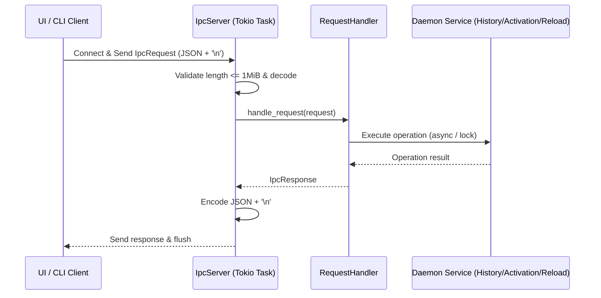

# IPC Subsystem

This document describes the Inter-Process Communication (IPC) architecture connecting the Pookie Paste daemon, ephemeral popup UI, and command-line interfaces.

For overall runtime structure, see [Runtime Model](../architecture/runtime-model.md). For activation and shortcut IPC interactions, see [Activation Overview](../activation/overview.md) and [Shortcut Overview](../shortcuts/overview.md).

---

## Purpose & Process Ownership

Pookie Paste employs a multi-process architecture to decouple persistent state from transient user interfaces:

```text
+-------------------------------------------------------+
|                    Daemon Process                     |
|  - SQLite database & image store                      |
|  - System clipboard watcher & writeback               |
|  - Global shortcut listener & rebind coordinator      |
|  - Window focus restoration & paste injection         |
|  - Owns Unix-Domain IPC Server                        |
+-------------------------------------------------------+
        ^                               ^
        | Unix Socket                   | Unix Socket
        v                               v
+-----------------------+       +-----------------------+
|     UI Process        |       |      CLI Commands     |
| - Short-lived client  |       | - Short-lived clients |
| - egui/eframe popup   |       | - pookie-paste --toggle
| - Ephemeral lifecycle |       | - pookie-paste --reload
+-----------------------+       +-----------------------+
```

### Why IPC Exists
* **Process Independence**: The UI popup is short-lived and terminates on item activation, explicit user dismissal, or focus loss where the active popup policy treats focus loss as a dismissal signal (see [Runtime Model](../architecture/runtime-model.md)). By isolating application state in the daemon, the UI can terminate or crash without risking clipboard history loss, database corruption, or listener disconnection.
* **Single Source of Truth**: SQLite storage, active clipboard listeners, self-write suppression fingerprints, and compositor connections are maintained exclusively by the daemon.
* **CLI Control**: Administrative and keybinding commands (`--toggle`, `--reload`, `--shortcut-status`) connect as short-lived clients to query or control the running daemon.

---

## Transport & Socket Discovery

IPC takes place exclusively over local Unix domain stream sockets (`tokio::net::UnixStream` / `tokio::net::UnixListener`).

### Socket Path Resolution
Defined in [`crates/ipc/src/socket_path.rs`](../../crates/ipc/src/socket_path.rs), the socket location is resolved in order:

1. **Primary Path (`$XDG_RUNTIME_DIR`)**:
   ```text
   $XDG_RUNTIME_DIR/pookie-paste/pookie.sock
   ```
   Standard on modern Linux distributions running `systemd-logind` or equivalent session managers. In this environment, `$XDG_RUNTIME_DIR` is conventionally created by the host system with user-only `0700` permissions.

2. **Fallback Path (`/tmp`)**:
   ```text
   /tmp/pookie-paste-<EUID>/pookie.sock
   ```
   Used when `$XDG_RUNTIME_DIR` is not set. `<EUID>` is the effective user ID retrieved via `libc::geteuid()`. Incorporating the EUID separates paths between different user accounts on shared systems to avoid collisions.

### Directory Initialization & Stale Socket Handling
When binding the server ([`IpcServer::bind`](../../crates/ipc/src/server.rs)):
1. **Directory Creation**: `fs::create_dir_all()` ensures the socket's parent directory exists. Pookie creates this directory using standard file-creation permissions governed by the process umask; it does not explicitly verify or enforce private permissions (`0700`) on the directory or socket file.
2. **Stale Socket Detection (`remove_stale_socket`)**:
   * If the socket file exists, the server attempts a synchronous probe connection (`UnixStream::connect`).
   * If the connection succeeds, another daemon is actively running. The bind fails with `ServerError::AlreadyRunning`.
   * If the connection fails with `ECONNREFUSED` (Connection refused), the socket file was left behind by a terminated or crashed process. The stale socket file is automatically unlinked with `fs::remove_file()`.
3. **Automatic Cleanup**: `IpcServer` implements `Drop` to unlink the socket file upon clean daemon shutdown.

---

## Framing & Serialization

Wire communication uses **newline-delimited JSON** ([`crates/ipc/src/codec.rs`](../../crates/ipc/src/codec.rs)):

```text
+------------------------------------+------+
| JSON Payload (IpcRequest / Response) | '\n' |
+------------------------------------+------+
```

* **Framing**: Every message is encoded as a compact JSON string terminated by a single newline byte (`b'\n'`, `0x0A`).
* **Frame Size Ceiling**: A strict limit of **1 MiB** (`MAX_FRAME_SIZE = 1024 * 1024`) is enforced during streaming reads. Payloads exceeding this limit abort the connection with `ServerError::FrameTooLarge`.
* **Zero Payload Bloat**: Raw image bytes are never transmitted across the IPC socket. Image items in history metadata contain only relative file paths within the data directory (e.g. `images/<uuid>.png`), which the UI process reads directly from disk.

---

## Protocol Architecture

The wire protocol is strongly typed in [`crates/ipc/src/protocol.rs`](../../crates/ipc/src/protocol.rs) via Serde tagged enums. It is a direct request/response contract rather than JSON-RPC.

### Representative Requests (`IpcRequest`)
See [`crates/ipc/src/protocol.rs`](../../crates/ipc/src/protocol.rs) for complete variant and field definitions.
```rust
pub enum IpcRequest {
    // Clipboard & History
    GetHistory,
    ActivateItem { id: String, target_id: Option<IpcFocusTarget> },
    DeleteItem { id: String },
    TogglePinItem { id: String },
    ClearHistory,

    // Focus & UI
    CaptureFocusTarget,
    ToggleUi,

    // Shortcuts & Configuration
    GetShortcutStatus,
    RecheckShortcutStatus,
    SetShortcut { modifiers: Vec<String>, key: String },
    ConfigurePortalShortcut,
    ReloadConfig,

    // Diagnostics & Utilities
    Ping,
    CopyText { text: String },
}
```

### Representative Responses (`IpcResponse`)
See [`crates/ipc/src/protocol.rs`](../../crates/ipc/src/protocol.rs) for complete variant and field definitions.
```rust
pub enum IpcResponse {
    Pong,
    History { items: Vec<HistoryItem> },
    FocusTarget { target_id: Option<IpcFocusTarget> },
    Activated { outcome: ActivationOutcome },
    Deleted { deleted: bool },
    PinToggled { id: String, is_pinned: bool },
    Cleared { count: u64 },
    UiToggled { launched: bool },
    ShortcutStatus { status: ShortcutStatusInfo },
    ConfigReloaded { status: ShortcutStatusInfo },
    TextCopied,
    Error { message: String },
}
```

---

## Request Categories & Lifecycle

Requests fall into distinct operational categories:

### 1. History Operations
* **`GetHistory`**: Returns all clipboard history entries as lightweight `HistoryItem` metadata.
* **`DeleteItem`**: Removes an entry from SQLite storage and cleans up any associated image preview files on disk.
* **`TogglePinItem`**: Toggles whether an item is pinned to the top of the history list.
* **`ClearHistory`**: Removes all unpinned entries from SQLite and deletes orphan preview images.

### 2. Focus & Activation
* **`CaptureFocusTarget`**: Queried by the UI *before* displaying the popup window. Observational query that samples the platform focus backend and returns an `IpcFocusTarget` (or `None` if unavailable) identifying the window currently holding user focus. Does not alter or store state in the daemon.
* **`ActivateItem`**: Triggered when the user selects a history item. Initiates content retrieval, desktop clipboard writeback, history promotion, focus restoration to the captured target, and synthetic paste. Returns `ActivationOutcome`.

### 3. UI Display & Single-Instance Lifecycle
* **`ToggleUi`**: Emitted by `pookie-paste --toggle` or global shortcuts. Invokes `UiLauncher::launch()`:
  * If no popup is currently open, spawns a new UI process (`UiLaunchOutcome::Launched`). Returns `launched: true`.
  * If a popup is already running, suppresses launching a second instance (`UiLaunchOutcome::AlreadyRunning`). Returns `launched: false`.
  * On compositor-managed backends, executes a bounded 50ms pre-toggle recheck before spawning the UI.

### 4. Global Shortcuts & Configuration
* **`GetShortcutStatus`**: Reads the in-memory shortcut status cache.
* **`RecheckShortcutStatus`**: Triggers authoritative inspection of active compositor state and updates the in-memory cache without mutating configuration.
* **`SetShortcut`**: Validates preflight conflicts, updates the runtime backend, and commits to `config.toml`.
* **`ConfigurePortalShortcut`**: Opens the KDE Plasma XDG GlobalShortcuts configuration dialog.
* **`ReloadConfig`**: Re-reads `config.toml` from disk and applies changes.

### 5. Utilities & Diagnostics
* **`CopyText`**: Writes raw text to the desktop clipboard via the daemon.
* **`Ping`**: Health check returning `Pong`.

---

## Read-Only vs. Mutating Operations

| Category | Requests | Mutates Disk / DB? | Mutates Runtime State? | Purpose |
| --- | --- | :---: | :---: | --- |
| **Passive Read** | `Ping`, `GetHistory`, `GetShortcutStatus` | No | No | Reads in-memory status cache or queries SQLite database. |
| **Observational Query** | `CaptureFocusTarget` | No | **No** | Samples active window from platform focus backend; does not alter daemon state. |
| **Live Status Refresh** | `RecheckShortcutStatus` | No | **Yes** (in-memory) | Inspects compositor shortcut state and updates in-memory status cache. |
| **Durable Mutation** | `DeleteItem`, `TogglePinItem`, `ClearHistory`, `SetShortcut` | **Yes** | **Yes** | Updates SQLite database, deletes preview files, or commits `config.toml`. |
| **Runtime Control** | `ToggleUi`, `ActivateItem`, `ConfigurePortalShortcut`, `CopyText`, `ReloadConfig` | No (except history promotion) | **Yes** | Spawns UI, injects paste, writes clipboard, or opens portal dialog. |

---

## Request Flow

The following sequence illustrates request routing across the IPC boundary:



---

## Concurrency & Connection Handling

The daemon's IPC server ([`crates/daemon/src/ipc_server.rs`](../../crates/daemon/src/ipc_server.rs)) manages concurrent clients asynchronously:

1. **Accept Loop**: The main listener task runs an infinite loop accepting connections via `server.accept().await`.
2. **Per-Connection Tasks**: Every accepted connection is spawned into its own independent Tokio green thread (`tokio::spawn`).
3. **Sequential Stream Processing**: Within a single connection task, requests are processed sequentially in a loop. A client may reuse a single connection for multiple requests or establish a new connection per command.
4. **Idle Timeout**: Connections that remain idle without sending a request for **30 seconds** (`IPC_READ_TIMEOUT`) are cleanly disconnected.
5. **Shared Daemon State**: Underlying services (`ClipboardHistoryService`, `ClipboardActivationService`, `ReloadCoordinator`, `UiLauncher`) are wrapped in `Arc` references and shared safely across all connection tasks.
6. **Internal Gate Locks**: Operations requiring strict serialization use dedicated internal gates (e.g. `ReloadCoordinator` serializes reload/recheck calls using an internal `reload_gate` mutex, preventing concurrent config writes).

---

## Failure Modes & Error Hierarchy

Pookie strictly separates failures across three layers:

```text
+---------------------------------------------------------------+
| 1. Framing & Codec Failures (Transport / Wire)                |
|    Connection refused, broken pipe, read timeout (30s),       |
|    frame > 1 MiB, invalid JSON, decode error                  |
|    -> Connection dropped / terminated (no IpcResponse sent)   |
+---------------------------------------------------------------+
                               |
+---------------------------------------------------------------+
| 2. Protocol / Request Rejections                              |
|    Valid IpcRequest received, but rejected by daemon handler  |
|    -> IpcResponse::Error { message }                          |
+---------------------------------------------------------------+
                               |
+---------------------------------------------------------------+
| 3. Domain Logic Outcomes                                      |
|    Valid request executed successfully with domain result     |
|    -> IpcResponse::Activated { outcome: PasteFailed }         |
|    -> IpcResponse::UiToggled { launched: false }              |
|    -> IpcResponse::FocusTarget { target_id: None }            |
+---------------------------------------------------------------+
```

### 1. Framing & Codec Failures
Errors occurring before a valid `IpcRequest` exists prevent protocol-level responses:
* **Framing & Size Limits**: If a frame exceeds 1 MiB (`MAX_FRAME_SIZE`), the server rejects it with `ServerError::FrameTooLarge` and terminates the connection.
* **Malformed JSON or Codec Error**: If received bytes fail to deserialize into an `IpcRequest` or lack a newline terminator, the server logs a `ServerError::Codec` error and closes the connection without emitting an `IpcResponse`.
* **Daemon Not Running**: Client connection attempts return `ECONNREFUSED` or `ENOENT`. CLI clients exit with an informative error message ("Pookie Paste daemon is not running").
* **Client Disconnect**: If a client closes the socket before the response is delivered, the server catches `BrokenPipe` or `ConnectionReset` and terminates the connection task quietly (`debug!` log).
* **Idle Timeout**: A connection idle for 30 seconds without a pending frame is closed by the server.

### 2. Protocol / Request Rejections (`IpcResponse::Error`)
When a valid, well-formed `IpcRequest` is decoded but cannot be fulfilled by daemon services, the daemon returns a typed `IpcResponse::Error { message: String }`:
* **Unparseable Parameters**: For example, an unrecognized window handle format in `ActivateItem`.
* **Subsystem Failures**: SQLite database query errors in `GetHistory`, preflight shortcut validation conflicts in `SetShortcut`, or subprocess spawn errors in `ConfigurePortalShortcut`.
* The transport remains open and healthy, allowing connection reuse.

### 3. Domain Outcomes
Domain results are **not** represented as transport or protocol errors:
* If focus restoration fails during activation, the response is a successful protocol message: `IpcResponse::Activated { outcome: ActivationOutcome::PasteFailed }`.
* If a focus target is unavailable during inspection, `CaptureFocusTarget` returns `IpcResponse::FocusTarget { target_id: None }`.
* If a popup is already running, `ToggleUi` returns `IpcResponse::UiToggled { launched: false }`.

---

## Daemon Singleton Mechanism

The Unix domain socket is Pookie Paste's sole mechanism for detecting an already-running daemon instance (there are no secondary lockfiles, pidfiles, or system semaphores):

1. **Startup Probe**: During startup in [`crates/daemon/src/main.rs`](../../crates/daemon/src/main.rs), `ipc_server::bind()` calls `remove_stale_socket(path)`.
2. **Live Instance Detection**: If `UnixStream::connect` establishes a connection to the socket path, another daemon is actively listening. The bind operation returns `ServerError::AlreadyRunning`.
3. **Graceful Exit**: The newly spawned daemon logs `"Pookie Paste is already running; exiting"` and exits immediately with code 0 (`Ok(())`).
4. **Stale Socket Recovery**: If `connect` fails with `ECONNREFUSED` (or the file is unlinked), the socket was left behind by an ungracefully terminated process. The stale socket file is removed with `fs::remove_file()` and binding proceeds.
5. **Preventing Contention**: This single-instance check ensures only one process accesses the SQLite database, binds global shortcut listeners, or handles clipboard events.

---

## Security & Trust Model

* **Local Socket Scoping**: Communication is restricted to a local Unix domain stream socket. No TCP or network-accessible ports are opened.
* **Filesystem Access Model**: Access control relies on standard OS filesystem permissions on the socket path:
  * In the primary path (`$XDG_RUNTIME_DIR/pookie-paste/pookie.sock`), security depends on the host session manager's convention of restricting `$XDG_RUNTIME_DIR` to the login user (typically mode `0700`).
  * In the fallback path (`/tmp/pookie-paste-<EUID>/pookie.sock`), embedding the effective user ID separates paths between users to prevent collisions. Pookie creates this directory with `fs::create_dir_all()` governed by the ambient process umask and does not explicitly enforce private directory or socket permissions.
* **User-Level Execution**: The IPC server runs under the daemon user's UID and does not require elevated privileges.
* **No In-Band Authentication or Encryption**: The wire protocol does not implement cryptographic encryption, authentication tokens, or peer credential validation (`SO_PEERCRED`). Trust is delegated entirely to the local OS filesystem boundary.

---

## Related Documentation

* [**Architecture Overview**](../architecture/overview.md): High-level system structure and subsystem boundaries.
* [**Runtime Model**](../architecture/runtime-model.md): Multi-process lifecycle, memory usage, and background threads.
* [**Clipboard Overview**](../clipboard/overview.md): History storage, canonical image persistence, and suppression markers.
* [**Activation Overview**](../activation/overview.md): Sequence and safety invariants for focus restoration and paste injection.
* [**Shortcut Overview**](../shortcuts/overview.md): Keybinding subsystem architecture, transactional rebinding, and compositor inspection.

---

## Implementation References

| Component | Responsibility | Repository File Path |
| --- | --- | --- |
| **Protocol Types** | Request, response, and content definitions | [`crates/ipc/src/protocol.rs`](../../crates/ipc/src/protocol.rs) |
| **Wire Codec** | Newline-delimited framing and size limit | [`crates/ipc/src/codec.rs`](../../crates/ipc/src/codec.rs) |
| **IPC Client** | Asynchronous client handle and connection logic | [`crates/ipc/src/client.rs`](../../crates/ipc/src/client.rs) |
| **IPC Server** | Stale socket handling, listener bind, and framing | [`crates/ipc/src/server.rs`](../../crates/ipc/src/server.rs) |
| **Socket Path** | XDG runtime directory and fallback resolution | [`crates/ipc/src/socket_path.rs`](../../crates/ipc/src/socket_path.rs) |
| **Daemon Server Task** | Concurrency, accept loop, and timeout management | [`crates/daemon/src/ipc_server.rs`](../../crates/daemon/src/ipc_server.rs) |
| **Request Handler** | Dispatching requests to daemon services | [`crates/daemon/src/request_handler.rs`](../../crates/daemon/src/request_handler.rs) |
| **CLI Client Actions** | Command-line IPC dispatch (`--toggle`, etc.) | [`crates/daemon/src/cli.rs`](../../crates/daemon/src/cli.rs) |
| **UI IPC Wrapper** | Popup client queries (`get_history`, `activate`) | [`crates/ui/src/ipc_client.rs`](../../crates/ui/src/ipc_client.rs) |
