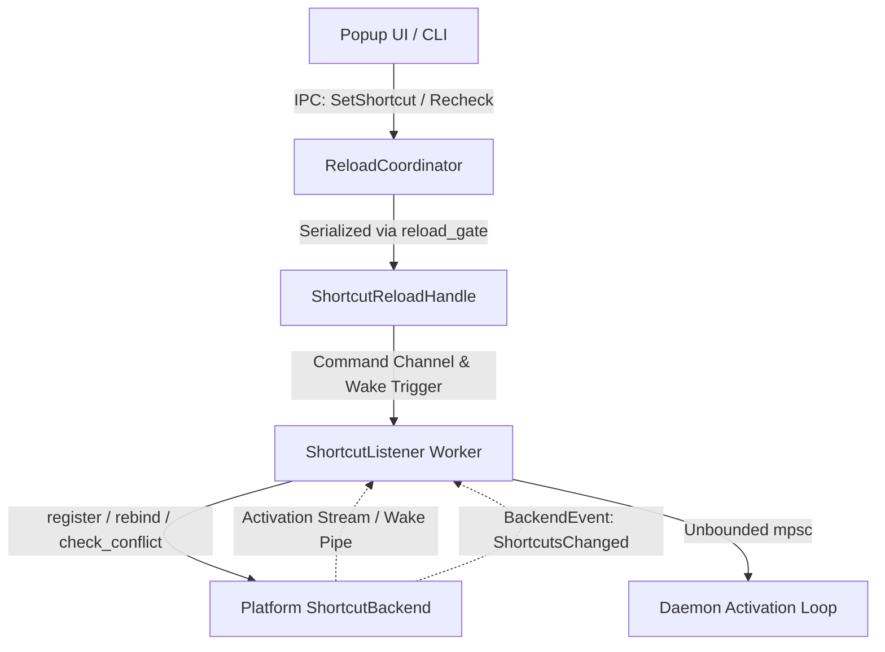

# Global Shortcuts Subsystem

This document provides an architectural overview of Pookie Paste's global shortcut subsystem: how shortcuts are configured, detected, registered, inspected, and updated across X11, desktop portals, and Wayland compositors.

For status representation, see [Shortcut Status Model](status-model.md). For platform-specific details, see the [Platform Guides](#platform-guides).

---

## Responsibilities

The global shortcut subsystem coordinates shortcut handling across diverse desktop environments:

* **Intent vs. Reality Decoupling**: Maintains the distinction between the user's desired configuration in `config.toml` and the active binding state reported by the platform.
* **Platform Abstraction**: Hides the fundamental differences between direct X11 root-window grabs, XDG Desktop Portal D-Bus sessions, and compositor-managed keybinds behind a unified backend trait.
* **Transactional Rebinding**: Ensures that runtime shortcut updates either take effect completely or roll back cleanly without leaving orphan grabs or corrupted state.
* **Preflight Conflict Detection**: Checks candidate key combinations against active compositor and application bindings before committing configuration changes.
* **UI Activation Trigger**: Emits activation signals to request popup display through the daemon while preserving single-instance UI behavior when registered shortcuts fire or when external compositor shortcuts invoke daemon IPC.

---

## Capability & Ownership Model

Global shortcuts cannot be implemented through a single unified mechanism on modern Linux desktops. Pookie models shortcut capabilities into four distinct categories:

| Capability | Backend Example | Who Owns the Binding? | Mechanism |
| --- | --- | --- | --- |
| **`Native`** | X11 (`X11ShortcutBackend`) | **Pookie** | Direct passive root-window grab (`XGrabKey`). |
| **`Portal`** | KDE Plasma Wayland (`WaylandShortcutBackend`) | **Desktop Portal** | D-Bus session with `org.freedesktop.portal.GlobalShortcuts`. |
| **`CompositorManaged`** | Sway, Hyprland (`SwayShortcutBackend`, `HyprlandShortcutBackend`) | **Compositor** | Compositor binds key and executes `pookie-paste --toggle` (requesting popup display while preserving single-instance UI behavior). |
| **`Unsupported`** | Headless or unsupported sessions | *None* | Global shortcuts are unavailable; activation occurs solely via direct CLI invocation. |

### Concepts Kept Distinct

To prevent architectural ambiguity, the following concepts are strictly separated throughout the codebase:

* **Configured / Desired Shortcut**: The key combination written to `~/.config/pookie-paste/config.toml`. Represents user intent.
* **Effective Shortcut**: The key combination that actually triggers activation at runtime (e.g. as assigned and reported by the desktop portal).
* **Backend Capability**: What mechanism the active desktop environment supports (`Native`, `Portal`, `CompositorManaged`, `Unsupported`).
* **Runtime Registration State**: The active health and operational state of the listener worker (`Initializing`, `Active`, `CompositorManaged`, `Conflict`, `Unavailable`, `Failed`).
* **Compositor Binding State**: For compositor-managed environments, whether the compositor's active layout contains an inspected binding (`Verified`, `BoundUnverified`, `Unconfigured`, `Conflict`).

---

## Runtime Architecture

The subsystem consists of four core components decoupled across asynchronous boundaries:



* **`ShortcutBackend`** ([`crates/daemon/src/shortcut_backend.rs`](../../crates/daemon/src/shortcut_backend.rs)): Trait implemented by platform backends providing `register()`, `rebind()`, `wait_for_activation()`, `check_conflict()`, and capability negotiation.
* **`ShortcutListener`** ([`crates/daemon/src/shortcut_listener.rs`](../../crates/daemon/src/shortcut_listener.rs)): Dedicated worker thread running the platform event loop. It owns the synchronous backend instance, executes thread-safe commands via channels, and receives activation events without blocking async tokio workers.
* **`ShortcutReloadHandle`** ([`crates/daemon/src/shortcut_listener.rs`](../../crates/daemon/src/shortcut_listener.rs)): Cloneable, thread-safe handle providing async control over the worker thread (`reload()`, `recheck()`, `check_conflict()`, `configure_portal()`).
* **`ReloadCoordinator`** ([`crates/daemon/src/reload_coordinator.rs`](../../crates/daemon/src/reload_coordinator.rs)): Async orchestrator that serializes reload and rebind requests using an internal `reload_gate` mutex, executing capability-specific transactions and file commits.

---

## Shortcut Change Lifecycle (`SetShortcut`)

When a user records and saves a new shortcut in the UI, or issues an IPC `SetShortcut` command, `ReloadCoordinator::set_shortcut()` enforces capability-specific semantics:

### 1. Native (X11) Transaction
1. **Prepare**: Writes updated configuration content into a sibling temporary file (`.config.toml.tmp.<uuid>`) preserving permissions.
2. **Rebind**: Calls `ShortcutListener::reload()`. The worker attempts passive root-window grabs on the replacement keycode and all modifier mask permutations.
3. **Rollback on Grab Failure**: If X11 returns `BadAccess` (key already grabbed by another application), newly acquired masks are immediately released, the previous active grab is retained, the temporary file is deleted, and `ShortcutError::Conflict` is returned.
4. **Switch Registration**: Upon replacement grab success, the backend ungrabs the previous keycode/masks and switches its active runtime registration.
5. **Commit**: The coordinator atomically renames the temporary file over `config.toml`.
6. **Rollback on Commit Failure**: If atomic rename fails after rebind, the coordinator immediately triggers an automatic rollback of the runtime grab to the previous working shortcut.

### 2. Desktop Portal (KDE Plasma)
Direct `SetShortcut` is rejected for portal sessions. In portal architectures, the desktop portal is authoritative over shortcut assignments. The UI routes reconfiguration through `ConfigurePortalShortcut`, prompting the desktop portal's native configuration dialog.

### 3. Compositor-Managed (Sway / Hyprland)
1. **Preflight Conflict Check**: Inspects the live compositor via IPC (`check_conflict()`). If the candidate key is occupied by another command, the operation fails with `ShortcutError::Conflict`.
2. **Fail Closed**: If the compositor IPC query fails or is unreachable, the check fails closed with an error. `config.toml` is never mutated on uncertain state.
3. **Persist Desired Intent**: If the key is free, the new desired shortcut is committed atomically to `config.toml`.
4. **Re-probe Compositor**: The worker re-checks live compositor state via IPC to update the status snippet and verify whether the new binding is active in the compositor.

---

## Recheck vs. Reload vs. Rebind

These four operations represent distinct runtime boundaries:

| Operation | Trigger | Config Mutated? | Reads Disk? | Probes Compositor? | Description |
| --- | :---: | :---: | :---: | :---: | --- |
| **`GetShortcutStatus`** | IPC | No | No | No | Passive read of current in-memory `ShortcutStatusInfo` cache. |
| **`RecheckShortcutStatus`** | CLI / UI | No | No | **Yes** | Authoritatively queries active compositor state without touching `config.toml`. Refreshes cache. |
| **`ReloadConfig`** | IPC / SIGHUP | No | **Yes** | **Yes** | Re-reads `config.toml` from disk and applies changes to the runtime backend. |
| **`SetShortcut`** | UI / IPC | **Yes** | No | **Yes** | Validates preflight, updates runtime binding, and commits new configuration to disk. |

### Invariant: Recheck is Read-Only
`recheck()` observes external system state. It never silently alters the desired shortcut in `config.toml` and never writes to compositor configuration files.

---

## Conflict Detection

Conflict detection varies fundamentally by platform capability:

* **X11**: Authoritative detection occurs through the operating system's key grab. If another client has grabbed the key, the X server returns `BadAccess`. Pookie catches this error during the grab batch and cleanly rolls back.
* **KDE Portal**: Collision handling is delegated entirely to the desktop portal dialog, which prompts the user if a shortcut collision occurs.
* **Sway / Hyprland**: Evaluated via read-only IPC inspection before modifying `config.toml`:
  * If the candidate shortcut is occupied by another command, the change is rejected and the existing desired shortcut is retained.
  * If IPC is unavailable, the operation fails closed to prevent accidental configuration corruption.

---

## Configuration Persistence

Shortcut configuration is stored in TOML format:

```text
~/.config/pookie-paste/config.toml
```

If neither `config.toml` nor legacy fallback paths exist, Pookie bootstraps the canonical default configuration file atomically using `O_CREAT | O_EXCL` (`create_new(true)`):

```toml
# Pookie Paste Configuration File
# Documentation: https://github.com/riyanj220/pookie-paste

[shortcut.primary]
modifiers = ["SUPER"]
key = "V"
```

### Config Meaning by Capability
* **X11**: `config.toml` strictly matches the active root-window key grab.
* **KDE Portal**: `config.toml` provides the initial preferred trigger, but the portal's persisted assignment is authoritative.
* **Sway / Hyprland**: `config.toml` records the desired shortcut used to generate snippets and diagnose compositor configuration. The compositor's own configuration owns the live binding.

---

## Runtime Status Refresh

External compositor configurations can drift at runtime (e.g. user manually edits `~/.config/sway/config` and runs `swaymsg reload`). To keep status accurate without burning CPU cycles on continuous polling, Pookie refreshes status at explicit boundaries:

1. **CLI Inspection**: Running `pookie-paste --shortcut-status` issues `RecheckShortcutStatus` to guarantee live compositor truth.
2. **UI Launch**: When opening the popup via `ToggleUi`, a bounded 50ms compositor recheck is performed for compositor-managed backends, updating the status before the UI renders.
3. **Explicit User Recheck**: Clicking "Check" in the UI shortcut setup view triggers an immediate recheck.
4. **Healthy State Quiescence**: Fully configured and verified systems run without background polling threads.

---

## Core Invariants

1. **Rollback on Failure**: Failed shortcut changes preserve the previous working shortcut and runtime state.
2. **Compositor Non-Interference**: Pookie never silently modifies external compositor configuration files.
3. **Portal Authority**: On KDE Wayland, the portal-reported effective shortcut is authoritative over `config.toml`.
4. **Fail-Closed Conflict Preflight**: In compositor-managed environments, candidate shortcut validation fails closed if compositor IPC is unreachable.

---

## Platform Guides

Detailed platform mechanics, IPC discovery, and troubleshooting:

* [**X11 Global Shortcuts**](platforms/x11.md): Passive grabs, modifier permutations, and transactional re-registration.
* [**KDE Desktop Portal Shortcuts**](platforms/kde-portal.md): D-Bus GlobalShortcuts protocol, signal handling, and portal UI.
* [**Sway Shortcuts**](platforms/sway.md): Sway IPC `GET_CONFIG`, variable expansion, and bindsym generation.
* [**Hyprland Shortcuts**](platforms/hyprland.md): Hyprland IPC `j/binds`, opaque Lua callbacks, and `BoundUnverified` semantics.

---

## Implementation References

| Component | Responsibility | Repository File Path |
| --- | --- | --- |
| **Backend Traits & Types** | `ShortcutBackend`, capability, and outcome enums | [`crates/daemon/src/shortcut_backend.rs`](../../crates/daemon/src/shortcut_backend.rs) |
| **Shortcut Listener** | Worker thread, event loop, and status cache | [`crates/daemon/src/shortcut_listener.rs`](../../crates/daemon/src/shortcut_listener.rs) |
| **Reload Coordinator** | Serialized reload, recheck, and atomic config update | [`crates/daemon/src/reload_coordinator.rs`](../../crates/daemon/src/reload_coordinator.rs) |
| **Configuration Model** | TOML parsing, bootstrapping, and atomic write | [`crates/daemon/src/shortcut_config.rs`](../../crates/daemon/src/shortcut_config.rs) |
| **IPC Protocol Types** | `ShortcutStatusInfo`, `IpcShortcutState`, outcomes | [`crates/ipc/src/protocol.rs`](../../crates/ipc/src/protocol.rs) |
| **UI Setup View** | Attention banner, step workflow, and key recorder | [`crates/ui/src/shortcut_view.rs`](../../crates/ui/src/shortcut_view.rs) |
