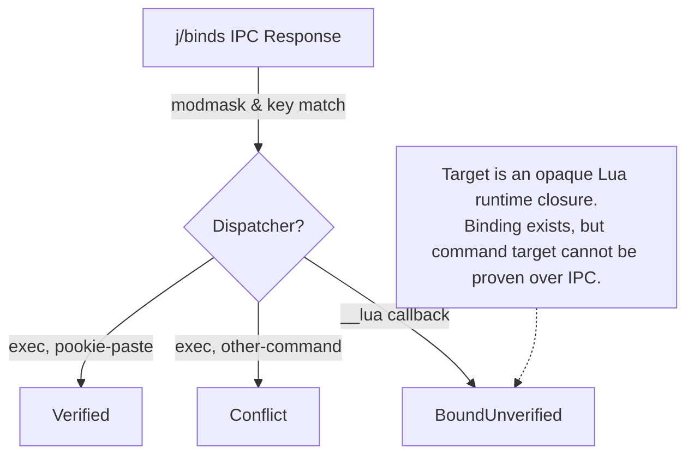

# Hyprland Compositor-Managed Shortcuts

This document describes the Hyprland compositor-managed shortcut implementation in Pookie Paste: live JSON IPC inspection (`j/binds`), modifier bitmask parsing, opaque Lua callback handling, and `BoundUnverified` status semantics.

For the common architecture, see [Shortcut Overview](../overview.md).

---

## Ownership & Philosophy

As with Sway, Hyprland manages global keyboard bindings directly in the compositor. Pookie does not install global hooks into the Wayland session; instead, Hyprland captures the shortcut and executes `pookie-paste --toggle`.

Pookie stores the user's desired shortcut in `~/.config/pookie-paste/config.toml` and generates the corresponding snippet for `~/.config/hypr/hyprland.conf` or `hyprland.lua`. Pookie never silently modifies Hyprland configuration files.

---

## Generated Binding Snippet

Pookie formats binding snippets adhering to Hyprland's modern Lua syntax (Hyprland 0.56+):

```lua
hl.bind("SUPER + V", hl.dsp.exec_cmd("pookie-paste --toggle"))
```

For legacy `hyprland.conf` configurations, Pookie supports the standard Hyprlang format:

```hyprlang
bind = SUPER, V, exec, pookie-paste --toggle
```

Modifiers are mapped to standard Hyprland keyword tokens (`SUPER`, `CTRL`, `ALT`, `SHIFT`). Pookie does not generate `bindd` directives.

---

## Live IPC Inspection (`$HYPRLAND_INSTANCE_SIGNATURE` & `j/binds`)

[`HyprlandShortcutBackend`](../../../crates/daemon/src/hyprland_shortcut_backend.rs) inspects active bindings through Hyprland's Unix domain command socket:

1. **Socket Discovery**: Resolves the command socket path (`.socket.sock`) using `$HYPRLAND_INSTANCE_SIGNATURE`:
   * `$XDG_RUNTIME_DIR/hypr/$HYPRLAND_INSTANCE_SIGNATURE/.socket.sock`
   * `/tmp/hypr/$HYPRLAND_INSTANCE_SIGNATURE/.socket.sock`
2. **Command Dispatch**: Sends `j/binds` over the IPC stream.
3. **JSON Deserialization**: Parses the returned JSON array of `HyprlandIpcBind` records:
   ```rust
   pub struct HyprlandIpcBind {
       pub modmask: u32,
       pub key: String,
       pub dispatcher: String,
       pub arg: String,
       pub submap: String,
   }
   ```

### Modifier Bitmask Verification
Hyprland reports modifiers as integer bitmasks:
* `HYPR_MOD_SHIFT = 1`
* `HYPR_MOD_CTRL  = 4`
* `HYPR_MOD_ALT   = 8`
* `HYPR_MOD_SUPER = 64`

The backend computes the expected bitmask from the configured `ShortcutModifiers` and matches entries by key and mask.

---

## Opaque Lua Callbacks & `BoundUnverified`

In Hyprland setups driven by Lua configurations or plugins, shortcuts are often bound through script closures. When queried over `j/binds`, Hyprland reports these entries with:
* `dispatcher: "__lua"`
* `arg: "<callback_id>"` (e.g. `__lua_cb_42`)



### Why `BoundUnverified` Is Truthful and Healthy
When an opaque Lua callback is encountered:
1. **Binding existence can be observed**: The key combination is actively registered in the compositor's layout and will not be passed through to underlying client windows.
2. **Exact callback/command ownership cannot be proven**: Pookie cannot inspect the Lua closure bytecode over IPC to prove that it executes `pookie-paste --toggle`.
3. **Truthful Classification**: Pookie reports this state as **`BoundUnverified`**.
4. **Accepted in UI**: In Pookie's progressive-disclosure UI, `BoundUnverified` is treated as a valid, configured state. The multi-step setup view collapses to the minimal `Current shortcut` row with a `Change` button.
5. **No False Upgrades**: Pookie intentionally does not upgrade `BoundUnverified` to `Verified` merely because an activation request later arrives over IPC.

---

## Binding Status Diagnosis

| Diagnosis from `j/binds` | Meaning | Compositor Binding Status |
| --- | --- | :---: |
| **`VerifiedPookie`** | Direct `exec` dispatcher targeting `pookie-paste`. | **`Verified`** |
| **`OccupiedOpaque`** | Target is an opaque Lua callback (`__lua`). | **`BoundUnverified`** |
| **`Conflict`** | Bound to a different command or application. | **`Conflict`** |
| **`NotFound`** | Key chord does not exist in running binds table. | **`Unconfigured`** |

Authoritative status diagnosis in production strictly requires live compositor IPC. If Hyprland IPC is unreachable, the check fails closed.

---

## Preflight Conflict Detection

Before `ReloadCoordinator::set_shortcut()` commits a new desired shortcut to `config.toml`:
1. `HyprlandShortcutBackend::check_conflict(candidate)` sends `j/binds` to the running compositor.
2. If the key is bound to another command or an existing Lua callback, it returns `Ok(Some(details))`. The operation is rejected, preserving `config.toml`.
3. If the key is free or matches the current Pookie binding, the check returns `Ok(None)`.
4. **Fail-Closed Rule**: If the IPC socket cannot be reached, the check fails closed with an error.

---

## Stale Status Refresh

Because Hyprland allows dynamic runtime reloading (`hyprctl reload`), Pookie ensures status accuracy through defined refresh boundaries:
* **`pookie-paste --shortcut-status`**: Invokes `RecheckShortcutStatus` to query `j/binds` live.
* **Popup Open (`ToggleUi`)**: Executes a bounded 50ms IPC recheck before launching the UI.
* **UI Recheck Button**: Clicking "Check" in the setup view immediately re-probes `j/binds`.
