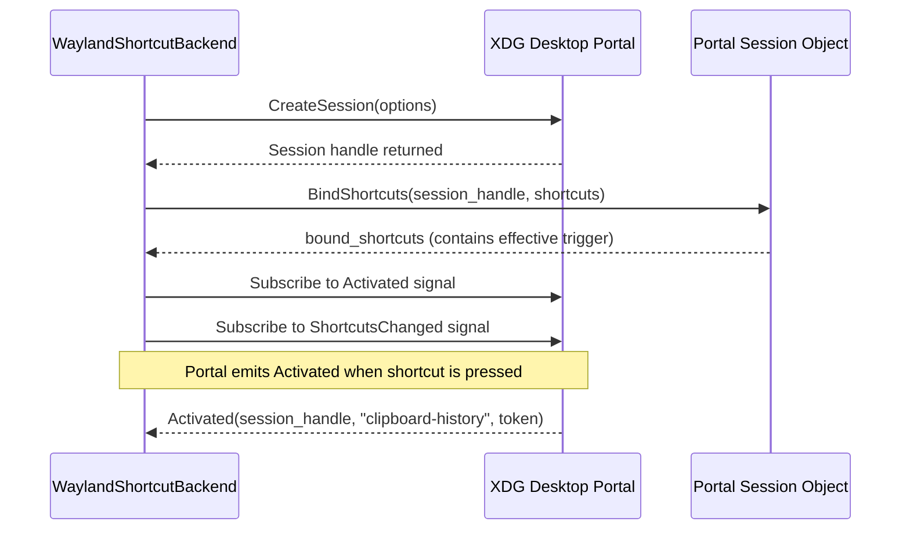

# KDE Plasma Desktop Portal Shortcuts

This document describes the KDE Plasma Wayland implementation of global shortcuts in Pookie Paste: session management via the XDG Desktop Portal, asynchronous D-Bus communication, portal reconfiguration dialogs, and authoritative effective trigger tracking.

For the common architecture, see [Shortcut Overview](../overview.md).

---

## Ownership & Architecture

In KDE Plasma on Wayland, applications cannot directly grab global keys. Shortcut ownership belongs to the desktop environment via the XDG Desktop Portal:

* **D-Bus Service**: `org.freedesktop.portal.Desktop`
* **D-Bus Path**: `/org/freedesktop/portal/desktop`
* **Interface**: `org.freedesktop.portal.GlobalShortcuts`
* **Application ID**: `io.github.riyanj220.PookiePaste`
* **Desktop File ID**: `io.github.riyanj220.PookiePaste.desktop`
* **Shortcut ID**: `clipboard-history` (Description: `"Open clipboard history"`)

Pookie connects via `zbus` over the session D-Bus.

---

## Session Lifecycle & Registration

The portal session lifecycle progresses through five asynchronous stages:



1. **Host Application Registration**: When `org.freedesktop.host.portal.Registry` is available on the session bus, Pookie registers its application identity on the connection.
2. **Session Creation**: Calls `CreateSession`, returning an object path representing the active global shortcuts session.
3. **Binding Request**: Calls `BindShortcuts` with `preferred_trigger` (formatted from the configured shortcut, e.g. `"Control+Alt+v"` or `"Super+v"`).
4. **Signal Subscriptions**: Subscribes to `Activated` and `ShortcutsChanged` signals before signaling worker readiness.
5. **Session Close**: When the daemon terminates, `session.close()` issues a D-Bus `Close` call on the session object to release resources.

---

## Authoritative Effective Trigger

> [!IMPORTANT]
> **On KDE Plasma Wayland, the portal-reported effective shortcut is authoritative.**

When `BindShortcuts` or `ListShortcuts` returns, the portal provides a list of `BoundShortcut` entries:

```rust
pub struct BoundShortcut {
    pub id: String,
    pub trigger_description: Option<String>,
}
```

The portal may assign a trigger that differs from the requested shortcut if:
* The user previously configured a custom shortcut for Pookie in KDE System Settings.
* The requested combination conflicted with another application, prompting the user to choose an alternative in the portal prompt.
* System policy overrode the requested combination.

Pookie records the portal's reported trigger as `effective_shortcut` in `ShortcutStatusInfo`. Pookie **never** attempts to silently overwrite KDE's persisted portal binding from `config.toml`.
If the portal reports no assigned trigger (`trigger_description` is absent or empty), Pookie reports runtime state `Unconfigured` (`needs_setup`), prompting the user to complete configuration via the portal dialog.

---

## Portal Reconfiguration (`ConfigureShortcuts`)

On systems with GlobalShortcuts interface version >= 2 (standard in modern KDE Plasma 6), the portal supports direct graphical reconfiguration.

### Reconfiguration Flow
1. User clicks the shortcut row in the Pookie UI, or the UI issues `IpcRequest::ConfigurePortalShortcut`.
2. The daemon invokes `configure_shortcuts()` on the portal session.
3. The portal displays KDE's native shortcut configuration dialog.
4. When the user completes the dialog or adjusts shortcuts in KDE System Settings, the portal emits the `ShortcutsChanged` signal over D-Bus:
   ```rust
   signal ShortcutsChanged(ObjectPath session_handle, Array shortcuts)
   ```
5. `WaylandShortcutBackend` receives the signal, extracts the updated trigger description for `clipboard-history`, updates its internal `effective_trigger`, and sends `BackendEvent::ShortcutsChanged` to the listener.
6. The listener updates `ShortcutStatusInfo` and wakes any waiting loops without restarting the backend.

---

## Request/Response Race Prevention

A common bug in portal clients is subscribing to the `Request::Response` signal only *after* invoking the portal method. On fast machines or with local portal implementations, the portal may emit `Response` before the client finishes registering its match rule, resulting in a hang until timeout.

Pookie's `PortalRequest::prepare()` installs the D-Bus match rule for the predicted request object path **before** invoking the portal method:

```rust
let handle_token = next_token(token_prefix);
let expected_path = expected_request_path(connection, &handle_token)?;
let response_stream = response_stream_for_path(connection, &expected_path.as_ref()).await?;
```

When the method call returns, the response stream is already buffered, eliminating the subscription race.
