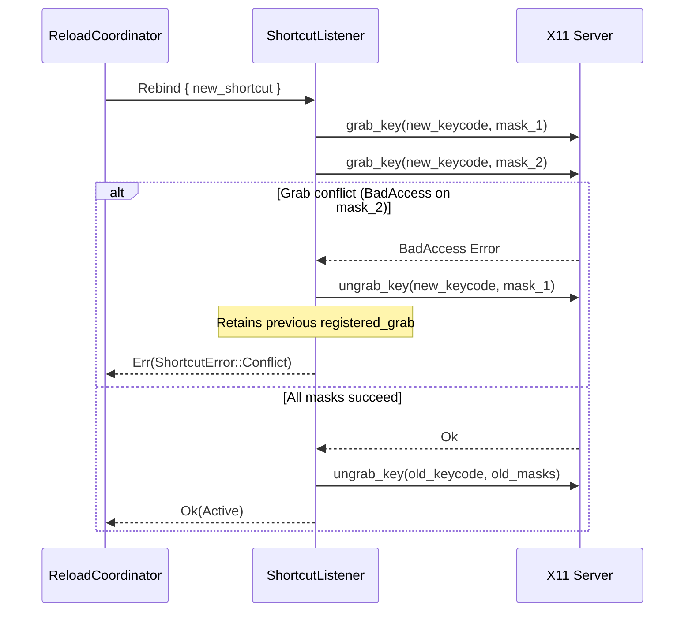

# X11 Global Shortcuts

This document describes the X11 platform implementation of global shortcuts in Pookie Paste: passive root-window grabs, modifier permutation handling, transactional re-registration, and auto-repeat suppression.

For the common architecture, see [Shortcut Overview](../overview.md).

---

## Ownership & Mechanism

On X11, Pookie acts as the direct owner of the global shortcut. The daemon connects to the X server using `x11rb` and establishes passive key grabs on the root window:

```rust
pub struct X11ShortcutBackend {
    connection: x11rb::rust_connection::RustConnection,
    root_window: u32,
    num_lock_mask: Option<ModMask>,
    registered_grab: Option<RegisteredGrab>,
    // ...
}
```

* **Keysym & Keycode Resolution**: The configured `ShortcutKey` is converted to a standard X11 keysym via `shortcut_keysym()`, then resolved to the server's current keycode via `find_keycode()`.
* **Root Window Target**: Passive grabs are placed on `root_window` using `GrabMode::ASYNC` for both keyboard and pointer.

---

## Modifier Permutations & Normalization

In the X11 protocol, passive grabs match exact modifier masks. If a grab is placed on `Mod4Mask` (Super), pressing `Super+V` while `CapsLock` or `NumLock` is engaged produces a different modifier mask (e.g. `Mod4Mask | LockMask`), causing the X server to bypass the grab.

To ensure reliable activation regardless of keyboard toggle states, `X11ShortcutBackend::compute_modifier_masks()` generates all four required mask permutations:

```rust
pub fn compute_modifier_masks(&self, modifiers: ShortcutModifiers) -> Vec<ModMask> {
    let base_mask = x11_modifier_mask(modifiers);
    let mut masks = vec![base_mask, base_mask | ModMask::LOCK];

    if let Some(num_lock) = self.num_lock_mask {
        masks.push(base_mask | num_lock);
        masks.push(base_mask | ModMask::LOCK | num_lock);
    }

    masks
}
```

### Dynamic NumLock Detection
Because the modifier bit assigned to `NumLock` varies across keyboard layouts and display servers (commonly `Mod2Mask`), the backend discovers the dynamic NumLock modifier on startup by searching for keysym `XK_NUM_LOCK` (0xff7f) in the modifier mapping.

---

## Transactional Re-Registration & Rollback

A critical invariant of Pookie's shortcut architecture is that **a failed shortcut change must preserve the previous working shortcut**.

When rebinding a shortcut at runtime, `X11ShortcutBackend` executes a transactional replacement:



### Transaction Steps
1. **New Grab Attempted First**: `execute_grab()` issues `grab_key` requests for the replacement keycode and all its modifier masks.
2. **Partial Batch Rollback on Conflict**: If any mask encounters an error (typically `BadAccess` / error code 10, indicating another client holds the grab), the backend immediately ungrabs only the masks acquired during this attempt. `self.registered_grab` remains completely untouched.
3. **Switch Runtime Registration**: Only after all replacement masks succeed does `release_grab()` ungrab the old keycode/masks and switch `self.registered_grab` to the new shortcut.
4. **Coordinator Commits Config**: Once `rebind()` returns `Ok`, `ReloadCoordinator` atomically renames the prepared temporary file over `config.toml`.
5. **Rollback on Commit Failure**: If the filesystem commit fails after successful rebind, `ReloadCoordinator` immediately triggers an automatic rollback of the runtime grab to the previous working shortcut.

---

## Configuration Persistence Guarantee

Configuration persistence is synchronized with runtime registration in [`ReloadCoordinator::set_shortcut()`](../../../crates/daemon/src/reload_coordinator.rs):

1. **Prepare**: Writes updated configuration content to a sibling temporary file (`.config.toml.tmp.<uuid>`).
2. **Rebind**: Calls `reload_handle.reload(new_shortcut)`. The worker executes the transactional grab switch above.
3. **Handle Grab Failure**: If X11 reports a conflict or grab failure, the temporary file is deleted. The previous runtime grab remains active, and `config.toml` is left completely untouched.
4. **Commit**: Only after `reload()` returns `Ok` is the temporary file atomically committed over `config.toml` via `fs::rename`.
5. **Rollback Safety**: If atomic rename fails after the backend has switched to the new grab, the coordinator invokes `reload(previous_shortcut)` to restore the original grab and prevent runtime/disk drift.

---

## Auto-Repeat Suppression

X11 generates continuous `KeyRelease` and `KeyPress` events while a key is physically held. Without suppression, holding the shortcut would repeatedly emit activation requests.

`wait_for_activation()` suppresses synthetic repeats:
1. On `KeyPress`, sets `self.key_down = true` and returns the activation event.
2. On `KeyRelease`, queries the event queue with `poll_for_event()`.
3. If an immediate subsequent `KeyPress` is found with an identical keycode and timestamp (the classic X11 auto-repeat signature), the release is treated as synthetic. `self.key_down` remains `true` and the event is dropped without re-arming.
4. Only when a genuine physical release occurs is `self.key_down` reset to `false`.

---

## Self-Pipe Wake Loop

To allow non-blocking interruptions of the blocking X11 event wait (e.g. when `SetShortcut` or daemon shutdown is invoked while the listener thread is waiting inside `next_event()`), `X11ShortcutBackend` maintains a non-blocking `UnixStream` pair.

When `wake()` is called, a byte is written to the wake stream. The listener thread wakes immediately, drains the pipe, processes pending control commands, and resumes listening.
